<!-- TOC -->

  * [数据结构与算法](#数据结构与算法)
      * [数据结构](#数据结构)
         * [线性数据结构](#线性数据结构)
            * [线性表](#线性表)
            * [队列](#队列)
            * [栈](#栈)
         * [非线性数据结构](#非线性数据结构)
            * [稀疏数组](#稀疏数组)
            * [Hash表](#hash表)
            * [树](#树)
            * [二叉树](#二叉树)
            * [满二叉树](#满二叉树)
            * [完全二叉树](#完全二叉树)
            * [二叉查找树(BST)](#二叉查找树bst)
      * [算法](#算法)
         * [排序算法](#排序算法)
         * [查找算法](#查找算法)
         * [双索引算法-快慢指针(leetcode)](#双索引算法-快慢指针leetcode)
         * [字符串匹配算法](#字符串匹配算法)

<!-- /TOC -->

# 数据结构与算法

````text
如有错误之处，请多多指教
````

PS:部分的图片来源于网上，如有侵权，请联系俺，俺会立刻删除。

往往有人把数据结构与算法混为一谈，以为学习数据结构就是在学习算法，或者以为学习算法
就是在学习数据结构，这样的理解是不对的。

数据结构与算法属于两种不同的学科，数据结构主要讲的是数据存储的问题，而算法主要讲的
是数据处理的问题，这两种学科的内容是不一样的。不过既然都涉及都数据层面，
且有些数据结构是随着某种算法的诞生而被发明出来的，所以前辈计算机科学家们把它们归为一门课程。

**由于数据结构与算法部分的内容不比普通的某一项技术，它的内容实在是很多，且较为复杂，我会尽我最大能力持续更新的。**

此外关于数据结构与算法,我推荐一个非常好的可视化网站: 
[数据结构与算法可视化](https://www.cs.usfca.edu/~galles/visualization/Algorithms.html)


## 数据结构

数据结构是计算机存储数据的方式，不同类型的数据，其存储数据的方式也各不相同。
我们的图片，音视频等内容以何种方式存储在磁盘上，就取决于这种类型的数据采用了什么样的数据结构。

数据结构按逻辑划分，大致可以分为线性数据结构和非线性数据结构(包括树，图等)。如果按具体的存储结构划分，
还可以分为顺序存储结构，散列存储结构，索引存储结构等等。


### 线性数据结构

**线性数据结构**是一个有序数据元素的集合，其中数据元素之间的关系是一对一的关系。
常见的线性结构有：**线性表，栈，队列，数组**等。


#### 线性表
线性表(list)是最基本的数据结构，它是由零个或多个数据元素组成的有序集合，
这个有序不是指的排序后的有序，而是指添加元素的顺序，假如2在1之前被放入了集合中，那么2肯定在1前面，不会因为大小原因而
改变他们在集合中的顺序。

链表的实现方式主要有数组和链表。

数组实现的线性表，访问速度是其最大的优点，但由于数组的容量是固定的，所以如果采用数组作为线性表的实现，
那么就涉及到扩容，调整元素位置等问题，这些操作是非常消耗性能的，因此数组实现的线性表适用于读多写少的环境。

链表可以分单向链表,双端链表和双向链表(双向循环链表)。
单向链表的每个节点都保存了指向下一个节点的引用(称为next)，单向链表的尾节点的下一个节点
的引用为null。

双端链表的每个Node都保存了前后2个节点的引用，双端链表的first节点的前一个节点为null,
 last节点的后一个节点为null。

双向链表的每个Node都保存了前后2个节点的引用，
双向链表的first节点的前一个节点指向last节点，
last节点的最后一个节点指向first节点。

无论是单链表和双链表，因为每个节点都保存了其他节点的引用，所以是比较消耗内存的。

链表实现的线性表，增删改操作的性能是其最大的优点，但链表并不支持下标这种RandomAccess随机访问的方式，
所以链表实现的线性表适用于写多读少的环境。

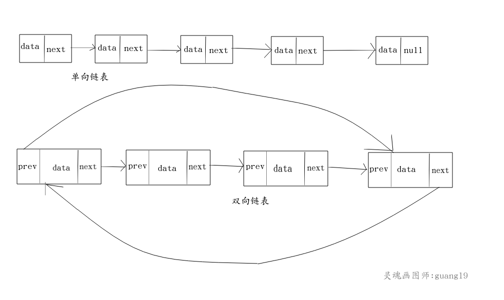


线性表实现源码(链式队列使用的是双端链表实现的):

- [ArrayList](https://github.com/guang19/framework-learning/blob/dev/datastructure-algorithm/src/main/java/com/github/anhTom2000/datastructure/list/ArrayList.java)

- [LinkedList](https://github.com/guang19/framework-learning/blob/dev/datastructure-algorithm/src/main/java/com/github/anhTom2000/datastructure/list/LinkedList.java)


#### 队列

队列（queue）是一种采用先进先出(FIFO)策略的抽象数据结构，即最先进队列的数据元素，
同样要最先出队列。队列跟我们排队买票一样，先来排队的肯定先买票，后来排队的的后买到票。

队列有两个重要的概念，一个叫队首，一个叫队尾，队首指向的是第一个元素，而队尾指向的是最后一个元素。
队列有两个主要的操作：入队(enqueue)操作 和 出队(dequeue)。
入队操作是将一个元素添加到队尾，出队操作就是取出队首的元素。


队列的底层可以用数组和链表实现。

对于数组实现的队列来说，其容量肯定是有限制的，当队列满了之后，如何能够再次使用呢？
这就是循环队列的作用了。

队列实现源码:

- [循环队列](https://github.com/guang19/framework-learning/blob/dev/datastructure-algorithm/src/main/java/com/github/anhTom2000/datastructure/queue/ArrayCircleQueue.java)

- [链式队列](https://github.com/guang19/framework-learning/blob/dev/datastructure-algorithm/src/main/java/com/github/anhTom2000/datastructure/list/LinkedList.java)

**PS:关于队列，可以参考: [掘金 - 队列](https://juejin.im/post/5d5fb74fe51d45620346b8d0) , 写得很详细。**


#### 栈
栈(stack)是一种后进先出(LIFO)的数据结构，即最后进入栈中的元素，最先出栈。
栈有两个主要的操作: 入栈(push) 和 出栈(pop)。
入栈操作是将一个元素置于栈顶，出栈操作是将栈顶元素取出。


栈同样可以由数组和链表实现，对于数组实现的栈来说，其容量肯定也有限制，所以个人认为实现栈的较好的方式是链表。

栈实现源码：[栈](https://github.com/guang19/framework-learning/blob/dev/datastructure-algorithm/src/main/java/com/github/anhTom2000/datastructure/list/LinkedList.java)


### 非线性数据结构
**非线性数据结构**中各个数据元素不再保持在一个线性序列中，每个数据元素可能与零个或者多个其他数据元素发生联系。
根据关系的不同，可分为层次结构和群结构。

常见的非线性数据结构主要有矩阵(多维数组)，广义表，树，图等。

#### 稀疏数组
稀疏数组又被称为稀疏矩阵，它本质上是一个二维数组。
当一个数组中大部分元素都未被使用，仅有少部分被占用，这就造成了空间的浪费。
为了解决这种问题，可以使用稀疏数组来保存该数组的数据，稀疏数组可以理解为原数组被压缩后的数组。


如图所示，有大部分的空间是无用的:
 


我们使用稀疏数组进行压缩,稀疏数组的第一部分所记录的是原数组的行数和列数，即元数据。
第二部分记录原数组中的有效值的位置和值。这样经过压缩后的数组不再需要分配原数组那么大的空间，解决了空间浪费的问题。


稀疏数组源码: [稀疏数组](https://github.com/guang19/framework-learning/blob/dev/datastructure-algorithm/src/main/java/com/github/anhTom2000/datastructure/spasearray/SparseArray.java)


#### Hash表
Hash表是一种能够快速访问，快速删除与修改的数据结构。我们知道数组的访问速度非常快，链表的增删改等操作的效率也是
非常高的，那有没有一种数据结构能够融合数组和链表的优点呢?可以说Hash表就是这样一种数据结构。

Hash表是通过关键码(key)进行访问，通过Hash表存储数据的数据结构，它通过某种映射函数将关键码映射到
Hash表的某个位置从而进行快速定位。 其中映射函数被称为散列函数(Hash函数)，Hash表被称为散列表。


Hash表源码: [HashTable](https://github.com/guang19/framework-learning/blob/dev/datastructure-algorithm/src/main/java/com/github/anhTom2000/datastructure/hash/HashTable.java)


#### 树
树是一种抽象的数据类型，它是由n个有限节点组成的一个具有层次关系的集合，因其结构像一棵倒状的树，所以称其为树结构。

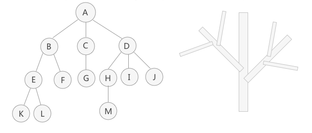

树的重要的概念

- 节点(结点): 在树结构中，存储数据的每个元素都被称为节点，如上图中的A，B，C等都是节点。

- 父节点: 一个节点A如果包含了另一个节点B， 则节点A就是节点B的父节点，节点B是节点A的子节点。

- 兄弟节点: 若多个节点具有相同的父节点，这些节点就是兄弟节点。

- 根节点: 每棵非空的树都有且仅有一个根节点，上图的A就是根节点。

- 叶子节点: 如果一个节点没有任何子节点，那么此节点就是叶子节点，上图的K，L，F，G等都是叶子节点。

- 节点的度: 节点的度是指该节点拥有的子树数。

- 树的度: 一棵树中，最大的节点度就是这棵树的度。

- 树的深度: 从这个树的根节点出发，根节点处于第一层，其孩子节点处于第二层，依次往下。上图树的深度
为4或3(计算方法的不同而已，如果把根节点算作第0层，那么树的深度就是3)。

- 森林: 由m棵互不相交的树组成的集合被称为森林，上图中，以B，C，D为根节点的三棵子树就组成了森林。


#### 二叉树
二叉树是一种特殊的树结构，二叉树的每个节点最多有2棵子树，即二叉树的节点的度最大为2。

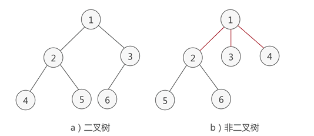

二叉树主要有如下性质:

- 二叉树的第 i 层最多有 2^(i-1) 个节点。

- 如果二叉树的为 d，那么二叉树总共有不超过 (2^d)-1 个节点。

二叉树有许多不同的种类，如: 满二叉树，完全二叉树，排序二叉树(二叉搜索树，二插查找树)，平衡二叉树等。

和线性表一样，二叉树也有链表(节点)实现和数组实现，数组实现的二叉树被称为 **顺序存储的二叉树。**

二叉树实现:

- [BinaryTree](https://github.com/guang19/framework-learning/blob/dev/datastructure-algorithm/src/main/java/com/github/anhTom2000/datastructure/tree/BinaryTree.java)

- [ArrayBinaryTree](https://github.com/guang19/framework-learning/blob/dev/datastructure-algorithm/src/main/java/com/github/anhTom2000/datastructure/tree/ArrayBinaryTree.java)


#### 满二叉树
满二叉树除了叶子节点，其他的节点的子树都为2,即除了叶子节点外，
它的每个节点的度都为2。

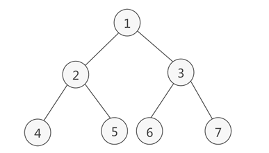

满二叉树主要有如下性质:

- 满二叉树的第 i 层的节点有 2(i-1) 个。

- 满二叉树的深度为 d ， 那么此满二叉树必须有: (2^d)-1 个节点。

- 具有 n 个节点的满二叉树的深度为: log2(n+1)。


#### 完全二叉树
如果一棵二叉树除去最后一层节点外是满二叉树，且最后一层节点是从左到右紧密分布的，那么此二叉树是一棵
完全二叉树。

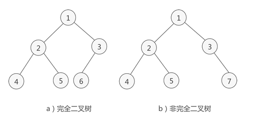


#### 二叉查找树(BST)
二叉查找树(Binary Search Tree)也被称为为二插排序树(Binary Sort Tree)。
二叉排序树具有如下性质：

- 若根节点的左子树不为空，那么其左子树的所有节点的值必将小于根节点的值。

- 若根节点的右子树不为空，那么其右子树的所有节点的值必将小于根节点的值。

- 左右子树也都是二叉查找树。

BST的左子节点的值小于根节点的值小于右子节点的值，这代表着如果对一棵BST进行中序遍历，那么即可得到
一个有序的数列。

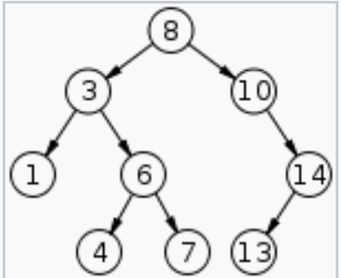

**关于BST的操作，我觉得这里需要讲解一下他的删除操作。**
BST的删除操作的节点需要分为三种情况，这里只探讨: 要删除的节点既有左子树也有右子树的情况。
当BST需要执行删除操作的时候，如果要删除的节点既有左子节点，也有右子节点，那么就需要找到这个节点的
前驱节点或者后继节点，然后使用前驱节点或后继节点替换掉要删除的节点，**这里的前驱节点和后继节点并不是指
前一个或下一个，而是指按二叉树的中序遍历顺序来讲，遍历这个节点时，它的前一个节点和后一个节点。**

如下图，要删除的节点为 47:

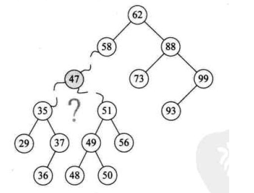

那么当中序遍历此BST时，47的前驱节点为37,后继节点为48，当使用前驱节点或后继节点替换掉要删除的节点后，
那么会有如下2种结果:

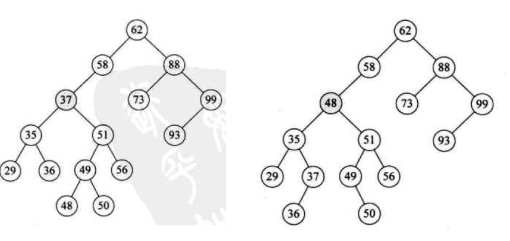

至于使用前驱还是后继，这个可以自行选择。

二叉查找树实现: [BinarySearchTree](https://github.com/guang19/framework-learning/blob/dev/datastructure-algorithm/src/main/java/com/github/anhTom2000/datastructure/tree/ArrayBinaryTree.java)

---


## 算法

### 排序算法

常见排序算法有10种,这里借用一张图总结下:


冒泡排序源码: [BubbleSort](https://github.com/guang19/framework-learning/blob/dev/datastructure-algorithm/src/main/java/com/github/anhTom2000/algorithm/sort/BubbleSort.java)

选择排序源码: [SelectionSort](https://github.com/guang19/framework-learning/blob/dev/datastructure-algorithm/src/main/java/com/github/anhTom2000/algorithm/sort/SelectionSort.java)

插入排序源码: [InsertionSort](https://github.com/guang19/framework-learning/blob/dev/datastructure-algorithm/src/main/java/com/github/anhTom2000/algorithm/sort/InsertionSort.java)

希尔排序源码: [ShellSort](https://github.com/guang19/framework-learning/blob/dev/datastructure-algorithm/src/main/java/com/github/anhTom2000/algorithm/sort/ShellSort.java)

快速排序源码: [QuickSort](https://github.com/guang19/framework-learning/blob/dev/datastructure-algorithm/src/main/java/com/github/anhTom2000/algorithm/sort/QuickSort.java)

归并排序源码: [MergeSort](https://github.com/guang19/framework-learning/blob/dev/datastructure-algorithm/src/main/java/com/github/anhTom2000/algorithm/sort/MergeSort.java)

堆排序源码: [HeapSort](https://github.com/guang19/framework-learning/blob/dev/datastructure-algorithm/src/main/java/com/github/anhTom2000/algorithm/sort/HeapSort.java)

基数排序源码: [RadixSort](https://github.com/guang19/framework-learning/blob/dev/datastructure-algorithm/src/main/java/com/github/anhTom2000/algorithm/sort/RadixSort.java)

计数排序源码: [CountingSort](https://github.com/guang19/framework-learning/blob/dev/datastructure-algorithm/src/main/java/com/github/anhTom2000/algorithm/sort/CountingSort.java)


### 查找算法

二分查找算法源码: [BinarySearch](https://github.com/guang19/framework-learning/blob/dev/datastructure-algorithm/src/main/java/com/github/anhTom2000/algorithm/search/BinarySearch.java)

插值查找算法源码: [InterpolationSearch](https://github.com/guang19/framework-learning/blob/dev/datastructure-algorithm/src/main/java/com/github/anhTom2000/algorithm/search/InterpolationSearch.java)

斐波那契查找算法源码: [FibonacciSearch](https://github.com/guang19/framework-learning/blob/dev/datastructure-algorithm/src/main/java/com/github/anhTom2000/algorithm/search/FibonacciSearch.java)


### 双索引算法-快慢指针(leetcode)

双指针，指的是在遍历对象的过程中，不是普通的使用单个指针进行访问，而是使用两个相同方向的指针进行扫描，从而达到相应的目的。

个人认为此算法就是充分利用数组有序这一特征，将本来需要两次遍历的操作简化为一次遍历，从而大大提高的程序的效率

下面用图来简单解释一下这个算法：

以leetcode第283题为例，需要看源码的小伙伴我会放链接在下方

首先我们定义两个指针，一个名为left，一个名为right

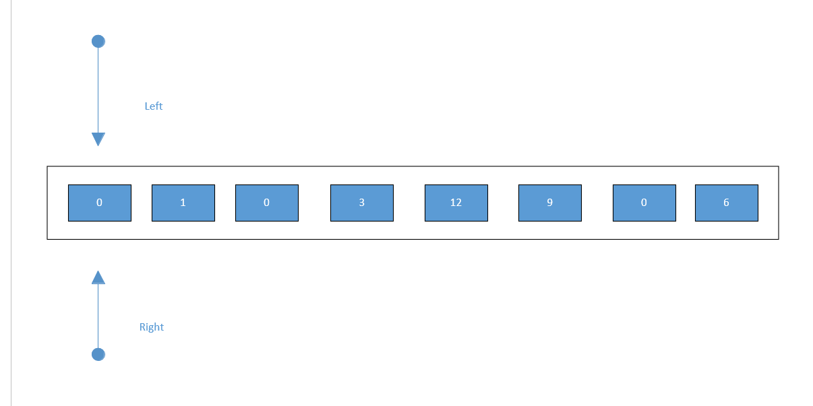

一开始left指针不动，right指针向后搜索，遇到一个非0的数字，将其覆盖到left指针位置上的元素，之后left指针的也向后移动

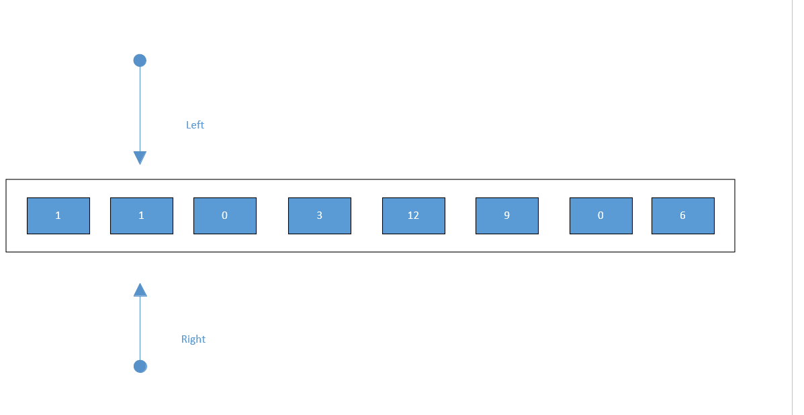

继续搜索，以不断的将非0元素往前挪，当right指针达到数组末端后，搜索结束。

可以看到，我们已经将所有非0元素都移动到数组的头部了，接下来对left+1位之后的元素全都赋值为0即可。

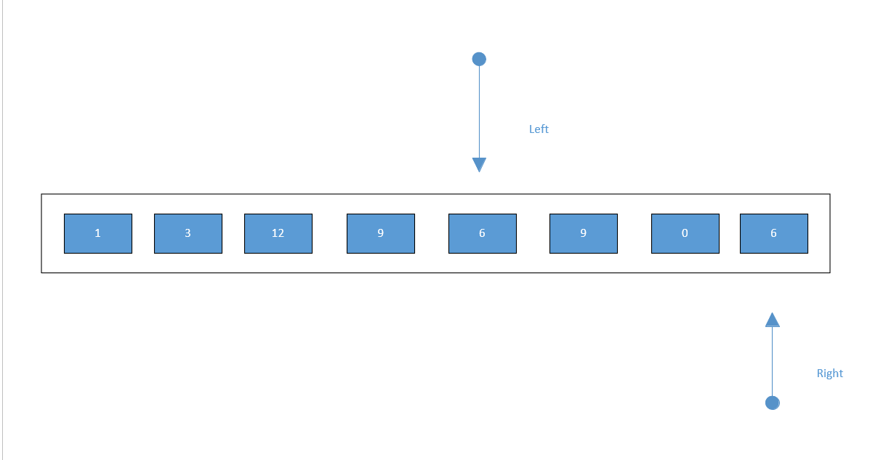

最终效果如下:

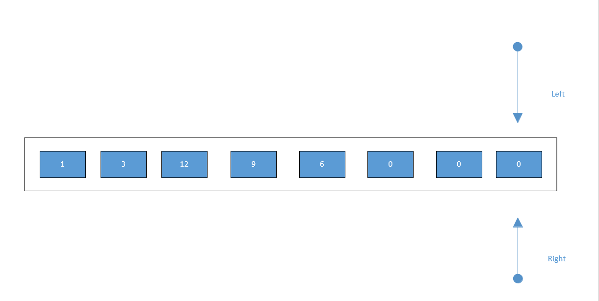

leetcode-283题: 移动零源码：[MoveZero](https://github.com/guang19/framework-learning/blob/dev/datastructure-algorithm/src/main/java/com/github/anhTom2000/algorithm/collisionPointer/MoveZero.java)

leetcode-26题: 删除数组的重复项源码：[DeleteDuplicate](https://github.com/guang19/framework-learning/blob/dev/datastructure-algorithm/src/main/java/com/github/anhTom2000/algorithm/collisionPointer/DeleteDuplicate.java)

leetcode-27题: 移除元素源码：[RemoveElement](https://github.com/guang19/framework-learning/blob/dev/datastructure-algorithm/src/main/java/com/github/anhTom2000/algorithm/collisionPointer/RemoveElement.java)


### 字符串匹配算法

暴力匹配算法源码: [ViolenceMatch](https://github.com/guang19/framework-learning/blob/dev/datastructure-algorithm/src/main/java/com/github/anhTom2000/algorithm/strmatch/ViolenceMatch.java)

kmp匹配算法源码: [KMPMatch](https://github.com/guang19/framework-learning/blob/dev/datastructure-algorithm/src/main/java/com/github/anhTom2000/algorithm/strmatch/KMPMatch.java)