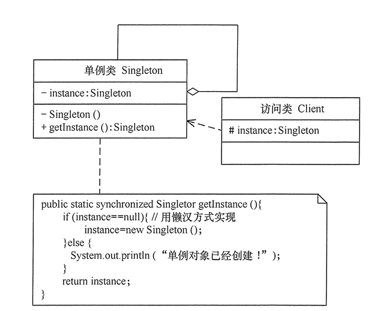
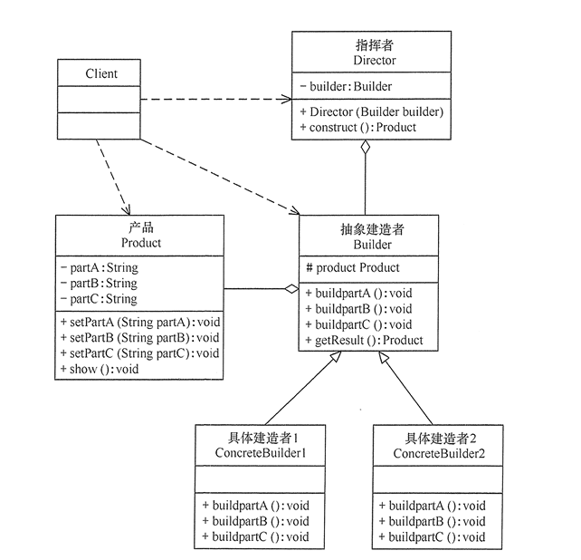

<!-- TOC -->


<!-- /TOC -->

# 设计模式

参考: 
- [菜鸟教程 - 设计模式](https://www.runoob.com/design-pattern/design-pattern-tutorial.html)

- [c语言中文网 - 设计模式](http://c.biancheng.net/view/1317.html) 


````text
如有错误之处，敬请指教。
````

**设计模式是前辈计算机科学家们在应用程序开发中积累的解决某些特定问题的经验和套路。它不是某种特定的语法，
而是一套用来提高代码可复用性，可维护性，可读性，稳健性以及安全性的解决方案。**
设计模式是软件开发的基石，如同大厦的一块砖石一样，巧妙合理的使用设计模式可以解决软件开发中的许多问题，
每种设计模式都描述了发生在我们周围不断发生的问题，以及该问题的核心方案，这也是设计模式被广泛使用的原因之一。
**设计模式不限制于某一种语言，它适用于c++,c#,go,java等面向对象的语言。**

PS:本篇文章中所有的代码将采用Java实现。


## 什么是GOF?
在1994年，Erich Gamma，Richard Helm ， Ralph Johnson和John Vlissides四人合著了一本书，
书名叫作(Design Patterns: Elements of Reusable Object-Oriented Software)《设计模式：可复用面向对象软件的基础》。
书中提出和总结了对于一些常见软件设计问题的标准解决方案，称为软件设计模式，
由于四位作者的被合称为 GOF， 所以书中的设计模式也被称为 "四人帮设计模式(Gang of Four design patterns)"。


### 设计模式的分类
GOF中总共有23种设计模式，**这些设计模式并不是孤立存在的，有些设计模式是相互关联的**，所以一个应用程序在很大程度上
可能会使用多种设计模式。

设计模式可分为3大类: 
1. **创建型模式(Creation Pattern)**: 创建型设计模式描述的是 "怎样创建对象",它的主要特点是将 对象的创建和使用分离，
这使得程序在创建对象与使用对象时更加灵活。 创建型模式有:

   - 工厂方法模式
  
   - 抽象工厂模式 
  
   - 单例模式
   
   - 建造者模式
   
   - 原型模式

2. **结构型模式(Structural Pattern)**: 结构型设计模式描述的是 "如何将类和对象按照某种布局，组成更大的结构"，这种类型的设计模式
关注的是类和对象的组合。 结构型模式有:

   - 代理模式
   
   - 适配器模式
   
   - 装饰器模式
   
   - 桥接模式
   
   - 组合模式

   - 外观模式
   
   - 享元模式
   
   - 过滤器模式(不存于GOF中)

3. **行为型设计模式(Behavioral Pattern)**: 行为型设计模式描述的是 "类或对象之间怎样相互协作以及怎样分配各自的职责，完成单个类或对象无法完成的任务"。
行为型设计模式有:

   - 观察者模式
   
   - 模板模式
   
   - 策略模式
   
   - 责任链模式
   
   - 中介者模式
   
   - 访问者模式
   
   - 命令模式
   
   - 解释器模式
   
   - 迭代器模式
   
   - 备忘录模式
   
   - 状态模式
   
   - 空对象模式(不存于GOF中)


### 设计模式7大原则

#### 开闭原则
开闭原则的定义是**对扩展开放，对修改关闭**。当应用程序的需求需要改变或扩展时，我们应该在不修改其源代码的
情况下，也能完成相应的目的。

开闭原则的优点是:**使得应用程序更易于维护和扩展。**


#### 里氏替换原则
里氏替换原则的定义是**继承必须确保超类所拥有的性质在子类中仍然成立**，即在基类出现的地方，其子类一定可以出现，
子类可以扩展基类的功能，但是尽量不要重写基类的功能。

里氏替换原则的优点是: **可以规范我们在正确的地方使用继承，而不至于造成继承的使用泛滥。**


#### 依赖倒转原则
依赖倒转原则是实现开比原则的基础，它的意思是当我们在编写面向对象的应用程序时，我们需要针对接口或抽象类编程，
而不具体的依赖某个实现类，这样可以降低系统之间的耦合性。

依赖倒转原则的优点是: **通过抽象建立系统之间的关系，使得系统具有高度的可维护性和可扩展性。**


#### 单一职责原则
单一职责原则规定一个类应该有且仅有一个能够引起它变化的原因，否则此类应该被拆分。单一职责的意思是不应该让一个类
承担太多职责，否则如果一个职责修改，其他职责可能也会跟着修改，且如果一个客户端只需要这个类的一个职责时，
那么客户端不得不承受引入其他职责的代价。

单一职责原则的优点是: **提高了代码的可读性，不至于一个类里啥元素都有，且系统之间更加的高内聚与低耦合。**


#### 接口分离原则
接口分离原则描述的是当一个接口的功能和职责太多时，我们需要将这个大接口分割成若干小接口，每一个小接口只
服务于其对应的客户端。但是我们也需要控制每个小接口的粒度，如果粒度太小，那么会增加许多冗余的接口，不易于维护。

接口分离原则的优点是: **避免一个接口里含有不同的职责，每个接口的职责分明，与单一职责相似，都符合高内聚与低耦合的思想。**


#### 迪米特法则
迪米特法则又称 "最少知道原则" ， 它的定义是 "只与你的朋友交谈，不与陌生人说话"， 这句话的含义是如果两个软件实体或
服务之间无需直接通信，那么就不应当发生直接的相互调用，可以通过第三方实体或服务进行转发通信。其目的是为了降低系统的
耦合度。

迪米特法则的优点是: **降低系统的耦合性，减少系统之间的关联，也符合高内聚与低耦合的思想。**


#### 合成复用原则
合成复用原则规定 当我们需要复用一些系统的代码的时候，应该优先考虑组合或聚合的方式实现，其次再考虑使用继承的方式实现。
如果一个基类的功能太多，而你只想复用一部分功能，使用继承就意味着不需要的功能也会被添加到当前系统中来，这就造成了不必要的麻烦。
所以可以优先考虑使用组合的方式完成代码的复用。

合成复用原则的优点是: **使系统易于维护，提高代码的可读性。**


### 23种设计模式


#### 工厂方法模式
工厂方法模式的意图是 定义一个创建产品对象的工厂接口，将产品对象的创建延迟到具体子工厂类中，这满足创建型模式中对象的创建和使用分离
的原则。
工厂方法模式由 抽象工厂，具体工厂，抽象产品，具体产品等要素组成，
我们把需要创建的对象叫作产品，创建产品的对象叫作工厂。

- 抽象工厂: 抽象工厂提供了创建产品的接口，用户/客户端 通过抽象工厂来创建和访问产品。

- 具体工厂: 具体工厂是抽象工厂的实现，包含了创建产品的过程。

- 抽象产品: 抽象产品定义了产品的规范，描述了产品的主要特性和功能。

- 具体产品: 具体产品实现了抽象产品，它与具体工厂一一对应。


工厂方法模式的优点有:

- 隐藏具体实现细节: 用户只需要具体工厂就可以创建对应的产品，无需关心具体工厂是如何创建产品的。
- 符合开闭原则:    在系统需要添加新的产品时，只需要添加其对应的具体工厂，无需修改原有的工厂和产品。  

工厂方法模式: 


工厂方法模式实例: [FactoryMethodTest](https://github.com/guang19/framework-learning/blob/dev/design-pattern/src/main/java/com/github/guang19/designpattern/factorymethod/FactoryMethodTest.java)


#### 抽象工厂模式
工厂方法模式考虑的是同一类产品的生产，如汽车工厂只生产汽车，空调工厂只生产空调。
而在现实中许多工厂是综合性的工厂，一家工厂可能既生产空调，又生产冰箱，这也是抽象工厂与工厂方法的区别，
抽象工厂考虑多类产品的生产，同一个工厂生产的位于不同等级的一组产品称为这个工厂的产品族。


抽象工厂模式的意图是 定义一个创建一组相关或相互依赖的工厂接口，使得用户可以使用这一个工厂就可以获取到不同的产品。
抽象工厂是工厂方法的升级版本，工厂方法只生产一个等级的产品，抽象工厂可以生产多个等级的产品。

抽象工厂和工厂方法一样，也由 抽象工厂，具体工厂，抽象产品，具体产品等要素组成，但抽象工厂可以创建
多个等级的产品。

抽象工厂模式:


抽象工厂实例:[AbstractFactoryTest](https://github.com/guang19/framework-learning/blob/dev/design-pattern/src/main/java/com/github/guang19/designpattern/abstractfactory/AbstractFactoryTest.java)


#### 单例模式
单例模式确保一个类只有一个实例，且该类提供访问这个唯一实例的方式。
单例模式有三个特点:
1. 单例类只有一个实例。
2. 该单例类的唯一实例必需由其自身创建。
3. 该单例类必须提供访问其唯一实例的方式。

单例模式:



单例模式实例: [Singleton](https://github.com/guang19/framework-learning/blob/dev/design-pattern/src/main/java/com/github/guang19/designpattern/singleton)

单例模式主要有两种写法:懒汉式和饿汉式。
网上有的文章说 **"饿汉式的单实例在类加载阶段就实例化了，而懒汉式在第一次获取实例的时候才初始化。"**
这里我从Java/Jvm(其他语言暂且不论)的角度来反驳下这种观点，如果各位同学同意这种观点，且是从我写的[类的生命周期](https://qsjzwithguang19forever.gitee.io/framework-learning/gitbook_doc/jdk_jvm_juc-learning/%E7%B1%BB%E7%9A%84%E7%94%9F%E5%91%BD%E5%91%A8%E6%9C%9F.html)
部分一直看过来的，那么请再好好思考下 "类加载" 三个字 ， 如果你对JVM有兴趣，也可分析下我的观点是对是错。

在JVM中，类的生命周期有5个阶段 : 加载 ， 连接 ， 初始化，使用和卸载。这几个阶段我已在[类的生命周期](https://qsjzwithguang19forever.gitee.io/framework-learning/gitbook_doc/jdk_jvm_juc-learning/%E7%B1%BB%E7%9A%84%E7%94%9F%E5%91%BD%E5%91%A8%E6%9C%9F.html)
里详细讲解过了，这里再回顾下 加载，连接，初始化几个阶段，至于使用和卸载与本观点论述的内容不大，所以不做描述。 

- 加载: JVM类加载器将class字节码读取到内存，将其保存在方法区，并在堆区生成该类的唯一Class对象。

- 连接: 连接分为三个阶段:验证，准备，解析。
   
   - 验证: 在验证阶段，JVM会对class字节流进行验证，验证其是否符合JVM规范且是否会对JVM造成恶意损害。
   
   - 准备: 准备阶段会为类的静态变量初始化零值，基本数据类型如int会赋予0，**引用类型会赋予null。**

   - 解析: 解析阶段会将常量池中的符号引用解析为直接引用。
   
- 初始化: 初始化阶段是类加载阶段的最后一个阶段，**在初始化类后，就可以使用类做我们需要做的事情了，如创建对象实例。**

我们明白: 饿汉式的单例是属于类的静态变量的，只有当类初始化时，才会初始化其静态变量，
仅凭这点就可以推翻网上谣传的观点了，但还没有完。

**类在何种情况下会被初始化呢?**

解决了这个问题，就可以彻底明白饿汉式实例化的时间了，你也就不会跟着大众喊出 "饿汉式单例浪费内存空间。" 这种
毫无根据的话语了。

**只有当我们主动使用类时，这个类才会被初始化，也才会初始化单例了。**
根据我查阅的资料，我总结了类主要涉及8种情况会被主动使用: 

1. 当jvm执行new指令时会初始化类，即当程序创建一个类的实例对象。
2. 当jvm执行getstatic指令时会初始化类，即程序访问类的静态变量(不是静态常量，常量归属于运行时常量池)。
3. 当jvm执行putstatic指令时会初始化类，即程序给类的静态变量赋值。
4. 当jvm执行invokestatic指令时会初始化类，即程序调用类的静态方法。
5. 当使用反射主动访问这个类时,也会初始化类,如Class.forname("..."),newInstance()等等。
6. 当初始化一个子类的时候，会先初始化这个子类的所有父类，然后才会初始化这个子类。
7. 当一个类是启动类时，即这个类拥有main方法，那么jvm会首先初始化这个类。
8. MethodHandle和VarHandle可以看作是轻量级的反射调用机制，而要想使用这2个调用，
就必须先使用findStatic/findStaticVarHandle来初始化要调用的类。

综上所述，**只考虑正常使用时初始化类的情况: 创建类的实例对象；调用类的静态方法；给类的静态变量赋值；访问类的静态变量 才会初始化类，
而当我们访问饿汉式单例的时候，90%的情况都是通过静态方法获取单例，所以大部分情况都是当我们获取单例的时候才会初始化单例，**
所以 "饿汉式的单实例在类加载阶段就实例化了"，"饿汉式单例浪费内存空间" 此类观点就不攻自破了。


#### 建造者模式
创建者模式的定义是将一个复杂对象的构造与它的表示分离，使用同样的构建过程可以创建不同的表述。简单理解就是
创建者模式将一个复杂对象，分解为多个简单的对象，然后通过这些简单对象再构造成最终的目标对象。
比如一台计算机由很多部件组成，如cpu，gpu，主板等等，我们不可能从一家厂商那里购买到所有的部件(不考虑整机)，
所以我们需要根据我们自己事先计划好的计算机的配置，然后从各个不同的厂商那里购部件，然后组装。

建造者模式使得一个复杂对象被分解为多个简单对象，且可以对每个简单对象进行定制，客户端也无需关系创建对象的细节。

建造者模式由 指挥者，抽象建造者，具体建造者，产品等要素组成:

- 产品: 产品是由多个部件组成的对象，它需要由具体建造者建造其各个组件。

- 抽象建造者: 抽象建造者定义了 创建产品各个组件以及获取最终复杂产品的接口。

- 具体建造者: 具体建造者实现了抽象建造者定义的接口，定义了创建复杂产品各个组件的逻辑。

- 指挥者: 指挥者负责调用建造者完成对复杂产品的创建。

建造者模式: 



建造者实例: [BuilderTest](https://github.com/guang19/framework-learning/blob/dev/design-pattern/src/main/java/com/github/guang19/designpattern/builder/BuilderTest.java)