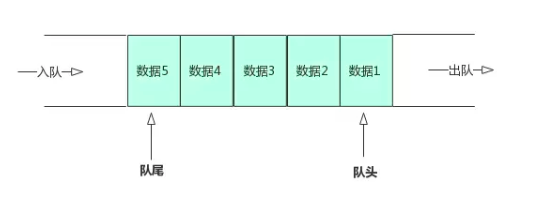

<!-- TOC -->
 
 * [数据结构](#数据结构)
   * [线性数据结构](#线性数据结构)
      * [线性表](#线性表)
      * [队列](#队列)
      * [栈](#栈)
   * [非线性数据结构](#非线性数据结构)
      * [稀疏数组](#稀疏数组)
      * [Hash表](#hash表)
      
<!-- /TOC -->

# 数据结构

## 线性数据结构

**线性数据结构**是一个有序数据元素的集合，其中数据元素之间的关系是一对一的关系。
常见的线性结构有：**线性表，栈，队列，数组**等。

#### 线性表
线性表(list)是最基本的数据结构，它是由零个或多个数据元素组成的有序集合，
这个有序不是指的排序后的有序，而是指添加元素的顺序，假如2在1之前被放入了集合中，那么2肯定在1前面，不会因为大小原因而
改变他们在集合中的顺序。

链表的实现方式主要有数组和链表。

数组实现的线性表，访问速度是其最大的优点，但由于数组的容量是固定的，所以如果采用数组作为线性表的实现，
那么就涉及到扩容，调整元素位置等问题，这些操作是非常消耗性能的，因此数组实现的线性表适用于读多写少的环境。

链表可以分单向链表,双端链表和双向链表(双向循环链表)。
单向链表的每个节点都保存了指向下一个节点的引用(称为next)，单向链表的尾节点的下一个节点
的引用为null。

双端链表的每个Node都保存了前后2个节点的引用，双端链表的first节点的前一个节点为null,
 last节点的后一个节点为null。

双向链表的每个Node都保存了前后2个节点的引用，
双向链表的first节点的前一个节点指向last节点，
last节点的最后一个节点指向first节点。

无论是单链表和双链表，因为每个节点都保存了其他节点的引用，所以是比较消耗内存的。

链表实现的线性表，增删改操作的性能是其最大的优点，但链表并不支持下标这种RandomAccess随机访问的方式，
所以链表实现的线性表适用于写多读少的环境。

线性表实现源码(链式队列使用的是双端链表实现的):

- [ArrayList](https://github.com/guang19/framework-learning/blob/dev/datastructure_algorithm/src/main/java/com/github/anhTom2000/datastructure/list/ArrayList.java)

- [LinkedList](https://github.com/guang19/framework-learning/blob/dev/datastructure_algorithm/src/main/java/com/github/anhTom2000/datastructure/list/LinkedList.java)

#### 队列

队列（queue）是一种采用先进先出(FIFO)策略的抽象数据结构，即最先进队列的数据元素，
同样要最先出队列。队列跟我们排队买票一样，先来排队的肯定先买票，后来排队的的后买到票。

队列有两个重要的概念，一个叫队首，一个叫队尾，队首指向的是第一个元素，而队尾指向的是最后一个元素。
队列有两个主要的操作：入队(enqueue)操作 和 出队(dequeue)。
入队操作是将一个元素添加到队尾，出队操作就是取出队首的元素。

队列的底层可以用数组和链表实现。

对于数组实现的队列来说，其容量肯定是有限制的，当队列满了之后，如何能够再次使用呢？
这就是循环队列的作用了。

队列实现源码:

- [循环队列](https://github.com/guang19/framework-learning/blob/dev/datastructure_algorithm/src/main/java/com/github/anhTom2000/datastructure/queue/ArrayCircleQueue.java)

- [链式队列](https://github.com/guang19/framework-learning/blob/dev/datastructure_algorithm/src/main/java/com/github/anhTom2000/datastructure/list/LinkedList.java)

**PS:关于队列，可以参考: [掘金 - 队列](https://juejin.im/post/5d5fb74fe51d45620346b8d0) , 写得很详细。**

#### 栈
栈(stack)是一种后进先出(LIFO)的数据结构，即最后进入栈中的元素，最先出栈。
栈有两个主要的操作: 入栈(push) 和 出栈(pop)。
入栈操作是将一个元素置于栈顶，出栈操作是将栈顶元素取出。

栈同样可以由数组和链表实现，对于数组实现的栈来说，其容量肯定也有限制，所以个人认为实现栈的较好的方式是链表。

栈实现源码：

- [栈](https://github.com/guang19/framework-learning/blob/dev/datastructure_algorithm/src/main/java/com/github/anhTom2000/datastructure/list/LinkedList.java)

## 非线性数据结构
**非线性数据结构**中各个数据元素不再保持在一个线性序列中，每个数据元素可能与零个或者多个其他数据元素发生联系。
根据关系的不同，可分为层次结构和群结构。常见的非线性数据结构主要有矩阵(多维数组)，广义表，树，图等。

#### 稀疏数组
稀疏数组又被成为稀疏矩阵，它本质上是一个二维数组。
当一个数组中大部分元素都未被使用，仅有少部分被占用，这就造成了空间的浪费。
为了解决这种问题，可以使用稀疏数组来保存该数组的数据，稀疏数组可以理解为原数组被压缩后的数组。

如图所示，有大部分的空间是无用的:
 

我们使用稀疏数组进行压缩,稀疏数组的第一部分所记录的是原数组的行数和列数，即元数据。
第二部分记录原数组中的有效值的位置和值。这样经过压缩后的数组不再需要分配原数组那么大的空间，解决了空间浪费的问题。

稀疏数组源码:

[稀疏数组](https://github.com/guang19/framework-learning/blob/dev/datastructure_algorithm/src/main/java/com/github/anhTom2000/datastructure/spasearray/SparseArray.java)

#### Hash表
Hash表是一种能够快速访问，快速删除与修改的数据结构。我们知道数组的访问速度非常快，链表的增删改等操作的效率也是
非常高的，那有没有一种数据结构能够融合数组和链表的优点呢?可以说Hash表就是这样一种数据结构。

Hash表是通过关键码(key)进行访问，通过Hash表存储数据的数据结构，它通过某种映射函数将关键码映射到
Hash表的某个位置从而进行快速定位。 其中映射函数被称为散列函数(Hash函数)，Hash表被称为散列表。

Hash表源码: [HashTable](https://github.com/guang19/framework-learning/blob/dev/datastructure_algorithm/src/main/java/com/github/anhTom2000/datastructure/hash/HashTable.java)
