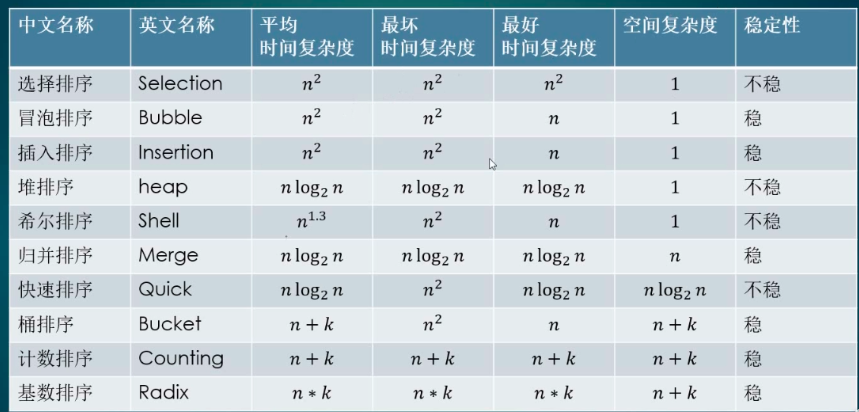

# 算法

   * [算法](#算法)
       * [排序算法](#排序算法)
       * [查找算法](#查找算法)
       * [双索引算法-快慢指针(leetcode)](#双索引算法-快慢指针leetcode)

### 排序算法

常见排序算法有10种,这里借用一张图总结下:

冒泡排序源码: [BubbleSort](https://github.com/guang19/framework-learning/blob/dev/datastructure_algorithm/src/main/java/com/github/anhTom2000/algorithm/sort/BubbleSort.java)

选择排序源码: [SelectionSort](https://github.com/guang19/framework-learning/blob/dev/datastructure_algorithm/src/main/java/com/github/anhTom2000/algorithm/sort/SelectionSort.java)

插入排序源码: [InsertionSort](https://github.com/guang19/framework-learning/blob/dev/datastructure_algorithm/src/main/java/com/github/anhTom2000/algorithm/sort/InsertionSort.java)

希尔排序源码: [ShellSort](https://github.com/guang19/framework-learning/blob/dev/datastructure_algorithm/src/main/java/com/github/anhTom2000/algorithm/sort/ShellSort.java)

快速排序源码: [QuickSort](https://github.com/guang19/framework-learning/blob/dev/datastructure_algorithm/src/main/java/com/github/anhTom2000/algorithm/sort/QuickSort.java)

归并排序源码: [MergeSort](https://github.com/guang19/framework-learning/blob/dev/datastructure_algorithm/src/main/java/com/github/anhTom2000/algorithm/sort/MergeSort.java)

基数排序源码: [RadixSort](https://github.com/guang19/framework-learning/blob/dev/datastructure_algorithm/src/main/java/com/github/anhTom2000/algorithm/sort/RadixSort.java)

计数排序源码: [CountingSort](https://github.com/guang19/framework-learning/blob/dev/datastructure_algorithm/src/main/java/com/github/anhTom2000/algorithm/sort/CountingSort.java)

### 查找算法

二分查找算法源码: [BinarySearch](https://github.com/guang19/framework-learning/blob/dev/datastructure_algorithm/src/main/java/com/github/anhTom2000/algorithm/search/BinarySearch.java)

插值查找算法源码: [InterpolationSearch](https://github.com/guang19/framework-learning/blob/dev/datastructure_algorithm/src/main/java/com/github/anhTom2000/algorithm/search/InterpolationSearch.java)

斐波那契查找算法源码: [FibonacciSearch](https://github.com/guang19/framework-learning/blob/dev/datastructure_algorithm/src/main/java/com/github/anhTom2000/algorithm/search/FibonacciSearch.java)

### 双索引算法-快慢指针(leetcode)

双指针，指的是在遍历对象的过程中，不是普通的使用单个指针进行访问，而是使用两个相同方向的指针进行扫描，从而达到相应的目的。

个人认为此算法就是充分利用数组有序这一特征，将本来需要两次遍历的操作简化为一次遍历，从而大大提高的程序的效率

下面用图来简单解释一下这个算法：

以leetcode第283题为例，需要看源码的小伙伴我会放链接在下方

首先我们定义两个指针，一个名为left，一个名为right

一开始left指针不动，right指针向后搜索，遇到一个非0的数字，将其覆盖到left指针位置上的元素，之后left指针的也向后移动

继续搜索，以不断的将非0元素往前挪，当right指针达到数组末端后，搜索结束。

可以看到，我们已经将所有非0元素都移动到数组的头部了，接下来对left+1位之后的元素全都赋值为0即可。

最终效果如下:

leetcode-283题: 移动零源码：[MoveZero](https://github.com/guang19/framework-learning/blob/dev/datastructure_algorithm/src/main/java/com/github/anhTom2000/algorithm/collisionPointer/MoveZero.java)

leetcode-26题: 删除数组的重复项源码：[DeleteDuplicate](https://github.com/guang19/framework-learning/blob/dev/datastructure_algorithm/src/main/java/com/github/anhTom2000/algorithm/collisionPointer/DeleteDuplicate.java)

leetcode-27题: 移除元素源码：[RemoveElement](https://github.com/guang19/framework-learning/blob/dev/datastructure_algorithm/src/main/java/com/github/anhTom2000/algorithm/collisionPointer/RemoveElement.java)