<!-- TOC -->

   * [设计模式](#设计模式)
      * [什么是GOF?](#什么是gof)
         * [设计模式的分类](#设计模式的分类)
         * [设计模式7大原则](#设计模式7大原则)
            * [开闭原则](#开闭原则)
            * [里氏替换原则](#里氏替换原则)
            * [依赖倒转原则](#依赖倒转原则)
            * [单一职责原则](#单一职责原则)
            * [接口分离原则](#接口分离原则)
            * [迪米特法则](#迪米特法则)
            * [合成复用原则](#合成复用原则)
         * [23种设计模式](#23种设计模式)
            * [工厂方法模式(Factory Method)](#工厂方法模式factory-method)
            * [抽象工厂模式(Abstract Factory)](#抽象工厂模式abstract-factory)
            * [单例模式(Singleton)](#单例模式singleton)
            * [建造者模式(Builder)](#建造者模式builder)
            * [原型模式(Prototype)](#原型模式prototype)
            * [代理模式(Proxy)](#代理模式proxy)
            * [适配器模式(Adapter)](#适配器模式adapter)
            * [装饰器模式(Decorator)](#装饰器模式decorator)
            * [桥接模式(Bridge)](#桥接模式bridge)
            * [组合模式(Composite)](#组合模式composite)
            * [外观模式(Facade)](#外观模式facade)
            * [享元模式(Flyweight)](#享元模式flyweight)
            * [观察者模式(Observer)](#观察者模式observer)
            * [模板方法模式(Template Method)](#模板方法模式template-method)
            * [策略模式(Strategy)](#策略模式strategy)
            * [责任链模式(Chain of Responsibility)](#责任链模式chain-of-responsibility)
            * [中介者模式(Mediator)](#中介者模式mediator)
            * [访问者模式(Visitor)](#访问者模式visitor)
            * [命令模式(Command)](#命令模式command)
            * [解释器模式(Interpreter)](#解释器模式interpreter)
            * [迭代器模式(Iterator)](#迭代器模式iterator)
            * [备忘录模式(Memento)](#备忘录模式memento)
            * [状态模式(State)](#状态模式state)

<!-- /TOC -->

# 设计模式

参考: 
- [菜鸟教程 - 设计模式](https://www.runoob.com/design-pattern/design-pattern-tutorial.html)

- [c语言中文网 - 设计模式](http://c.biancheng.net/view/1317.html) 


````text
如有错误之处，敬请指教。
````

**设计模式是前辈计算机科学家们在应用程序开发中积累的解决某些特定问题的经验和套路。它不是某种特定的语法，
而是一套用来提高代码可复用性，可维护性，可读性，稳健性以及安全性的解决方案。**
设计模式是软件开发的基石，如同大厦的一块砖石一样，巧妙合理的使用设计模式可以解决软件开发中的许多问题，
每种设计模式都描述了发生在我们周围不断发生的问题，以及该问题的核心方案，这也是设计模式被广泛使用的原因之一。
**设计模式不限制于某一种语言，它适用于c++,c#,go,java等面向对象的语言。**

PS:本篇文章中所有的代码将采用Java实现。


## 什么是GOF?
在1994年，Erich Gamma，Richard Helm ， Ralph Johnson和John Vlissides四人合著了一本书，
书名叫作(Design Patterns: Elements of Reusable Object-Oriented Software)《设计模式：可复用面向对象软件的基础》。
书中提出和总结了对于一些常见软件设计问题的标准解决方案，称为软件设计模式，
由于四位作者的被合称为 GOF， 所以书中的设计模式也被称为 "四人帮设计模式(Gang of Four design patterns)"。


### 设计模式的分类
GOF中总共有23种设计模式，**这些设计模式并不是孤立存在的，有些设计模式是相互关联的**，所以一个应用程序在很大程度上
可能会使用多种设计模式。

设计模式可分为3大类: 
1. **创建型模式(Creation Pattern)**: 创建型设计模式描述的是 "怎样创建对象",它的主要特点是将 对象的创建和使用分离，
这使得程序在创建对象与使用对象时更加灵活。 创建型模式有:

   - 工厂方法模式
  
   - 抽象工厂模式 
  
   - 单例模式
   
   - 建造者模式
   
   - 原型模式

2. **结构型模式(Structural Pattern)**: 结构型设计模式描述的是 "如何将类和对象按照某种布局，组成更大的结构"，这种类型的设计模式
关注的是类和对象的组合。 结构型模式有:

   - 代理模式
   
   - 适配器模式
   
   - 装饰器模式
   
   - 桥接模式
   
   - 组合模式

   - 外观模式
   
   - 享元模式

3. **行为型设计模式(Behavioral Pattern)**: 行为型设计模式描述的是 "类或对象之间怎样相互协作以及怎样分配各自的职责，完成单个类或对象无法完成的任务"。
行为型设计模式有:

   - 观察者模式
   
   - 模板方法模式
   
   - 策略模式
   
   - 责任链模式
   
   - 中介者模式
   
   - 访问者模式
   
   - 命令模式
   
   - 解释器模式
   
   - 迭代器模式
   
   - 备忘录模式
   
   - 状态模式


### 设计模式7大原则

#### 开闭原则
开闭原则的定义是**对扩展开放，对修改关闭**。当应用程序的需求需要改变或扩展时，我们应该在不修改其源代码的
情况下，也能完成相应的目的。

开闭原则的优点是:**使得应用程序更易于维护和扩展。**


#### 里氏替换原则
里氏替换原则的定义是**继承必须确保超类所拥有的性质在子类中仍然成立**，即在基类出现的地方，其子类一定可以出现，
子类可以扩展基类的功能，但是尽量不要重写基类的功能。

里氏替换原则的优点是: **可以规范我们在正确的地方使用继承，而不至于造成继承的使用泛滥。**


#### 依赖倒转原则
依赖倒转原则是实现开闭原则的基础，它的意思是当我们在编写面向对象的应用程序时，我们需要针对接口或抽象类编程，
而不具体的依赖某个实现类，这样可以降低系统之间的耦合性。

依赖倒转原则的优点是: **通过抽象建立系统之间的关系，使得系统具有高度的可维护性和可扩展性。**


#### 单一职责原则
单一职责原则规定一个类应该有且仅有一个能够引起它变化的原因，否则此类应该被拆分。单一职责的意思是不应该让一个类
承担太多职责，否则如果一个职责修改，其他职责可能也会跟着修改，且如果一个客户端只需要这个类的一个职责时，
那么客户端不得不承受引入其他职责的代价。

单一职责原则的优点是: **提高了代码的可读性，不至于一个类里啥元素都有，且系统之间更加的高内聚与低耦合。**


#### 接口分离原则
接口分离原则描述的是当一个接口的功能和职责太多时，我们需要将这个大接口分割成若干小接口，每一个小接口只
服务于其对应的客户端。但是我们也需要控制每个小接口的粒度，如果粒度太小，那么会增加许多冗余的接口，不利于维护。

接口分离原则的优点是: **避免一个接口里含有不同的职责，每个接口的职责分明，与单一职责相似，都符合高内聚与低耦合的思想。**


#### 迪米特法则
迪米特法则又称 "最少知道原则" ， 它的定义是 "只与你的朋友交谈，不与陌生人说话"， 这句话的含义是如果两个软件实体或
服务之间无需直接通信，那么就不应当发生直接的相互调用，可以通过第三方实体或服务进行转发通信。
其目的是为了降低系统的耦合度。

迪米特法则的优点是: **降低系统的耦合性，减少系统之间的关联，也符合高内聚与低耦合的思想。**


#### 合成复用原则
合成复用原则规定 当我们需要复用一些系统的代码的时候，应该优先考虑组合或聚合的方式实现，其次再考虑使用继承的方式实现。
如果一个基类的功能太多，而你只想复用一部分功能，使用继承就意味着不需要的功能也会被添加到当前系统中来，这就造成了不必要的麻烦。
所以可以优先考虑使用组合的方式完成代码的复用。

合成复用原则的优点是: **使系统易于维护，提高代码的可读性。**


### 23种设计模式


#### 工厂方法模式(Factory Method)
工厂方法模式的意图是 定义一个创建产品对象的工厂接口，将产品对象的创建延迟到具体子工厂类中，这满足创建型模式中对象的创建和使用分离
的原则。
工厂方法模式由 抽象工厂，具体工厂，抽象产品，具体产品等要素组成，
我们把需要创建的对象叫作产品，创建产品的对象叫作工厂。

- 抽象工厂: 抽象工厂声明了创建产品的接口，用户/客户端 通过抽象工厂来创建和访问产品。

- 具体工厂: 具体工厂是抽象工厂的实现，包含了创建产品的过程。

- 抽象产品: 抽象产品定义了产品的规范，描述了产品的主要特性和功能。

- 具体产品: 具体产品实现了抽象产品，它与具体工厂一一对应。


工厂方法模式的优点有:

- 隐藏具体实现细节: 用户只需要具体工厂就可以创建对应的产品，无需关心具体工厂是如何创建产品的。
- 符合开闭原则:    在系统需要添加新的产品时，只需要添加其对应的具体工厂，无需修改原有的工厂和产品。  

工厂方法模式: 

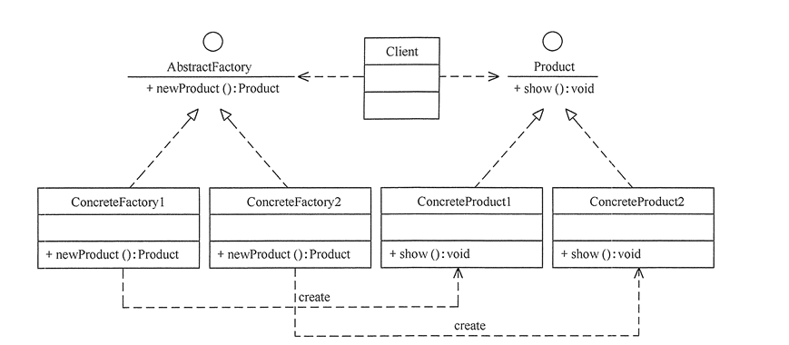

工厂方法模式实例: [FactoryMethodTest](https://github.com/guang19/framework-learning/blob/dev/design_pattern/src/main/java/com/github/guang19/designpattern/factorymethod/FactoryMethodTest.java)


#### 抽象工厂模式(Abstract Factory)
工厂方法模式考虑的是同一类产品的生产，如汽车工厂只生产汽车，空调工厂只生产空调。
而在现实中许多工厂是综合性的工厂，一家工厂可能既生产空调，又生产冰箱，这也是抽象工厂与工厂方法的区别，
抽象工厂考虑多类产品的生产，同一个工厂生产的位于不同等级的一组产品称为这个工厂的产品族。

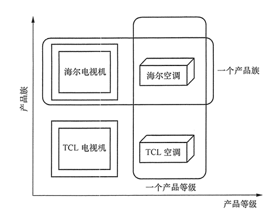

抽象工厂模式的意图是 定义一个创建一组相关或相互依赖的工厂接口，使得用户可以使用这一个工厂就可以获取到不同的产品。
抽象工厂是工厂方法的升级版本，工厂方法只生产一个等级的产品，抽象工厂可以生产多个等级的产品。

抽象工厂和工厂方法一样，也由 抽象工厂，具体工厂，抽象产品，具体产品等要素组成，但抽象工厂可以创建
多个等级的产品。

抽象工厂模式:

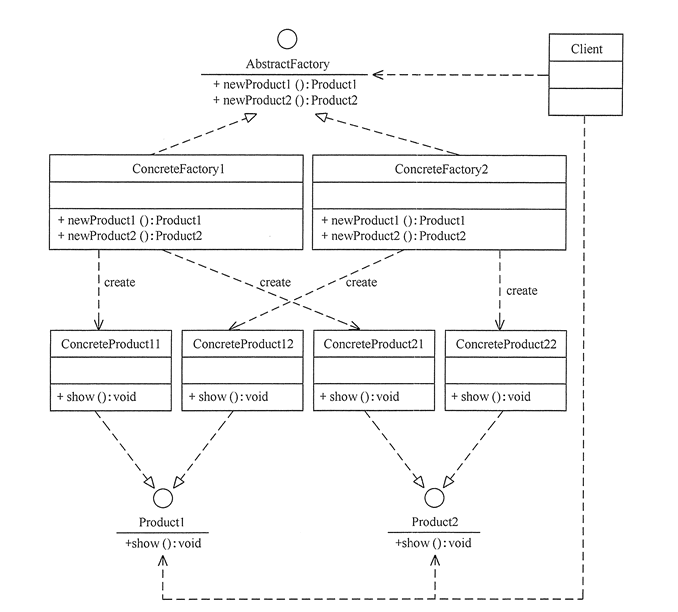

抽象工厂实例:[AbstractFactoryTest](https://github.com/guang19/framework-learning/blob/dev/design_pattern/src/main/java/com/github/guang19/designpattern/abstractfactory/AbstractFactoryTest.java)


#### 单例模式(Singleton)
单例模式确保一个类只有一个实例，且该类提供访问这个唯一实例的方式。
单例模式有三个特点:
1. 单例类只有一个实例。
2. 该单例类的唯一实例必需由其自身创建。
3. 该单例类必须提供访问其唯一实例的方式。

单例模式:


单例模式实例: [Singleton](https://github.com/guang19/framework-learning/blob/dev/design_pattern/src/main/java/com/github/guang19/designpattern/singleton)

单例模式主要有两种写法:懒汉式和饿汉式。
网上有的文章说 **"饿汉式的单实例在类加载阶段就实例化了，而懒汉式在第一次获取实例的时候才初始化。"**
这里我从Java/Jvm(其他语言暂且不论)的角度来反驳下这种观点，如果各位同学同意这种观点，且是从我写的[类的生命周期](https://qsjzwithguang19forever.gitee.io/framework-learning/gitbook_doc/jdk-jvm-juc/%E7%B1%BB%E7%9A%84%E7%94%9F%E5%91%BD%E5%91%A8%E6%9C%9F.html)
部分一直看过来的，那么请再好好思考下 "类加载" 三个字 ， 如果你对JVM有兴趣，也可分析下我的观点是对是错。

在JVM中，类的生命周期有5个阶段 : 加载 ， 连接 ， 初始化，使用和卸载。这几个阶段我已在[类的生命周期](https://qsjzwithguang19forever.gitee.io/framework-learning/gitbook_doc/jdk-jvm-juc/%E7%B1%BB%E7%9A%84%E7%94%9F%E5%91%BD%E5%91%A8%E6%9C%9F.html)
里详细讲解过了，这里再回顾下 加载，连接，初始化几个阶段，至于使用和卸载与本观点论述的内容不大，所以不做描述。 

- 加载: JVM类加载器将class字节码读取到内存，将其保存在方法区，并在堆区生成该类的唯一Class对象。

- 连接: 连接分为三个阶段:验证，准备，解析。
   
   - 验证: 在验证阶段，JVM会对class字节流进行验证，验证其是否符合JVM规范且是否会对JVM造成恶意损害。
   
   - 准备: 准备阶段会为类的静态变量初始化零值，基本数据类型如int会赋予0，**引用类型会赋予null。**

   - 解析: 解析阶段会将常量池中的符号引用解析为直接引用。
   
- 初始化: 初始化阶段是类加载阶段的最后一个阶段，**在初始化类后，就可以使用类做我们需要做的事情了，如创建对象实例。**

我们明白: 饿汉式的单例是属于类的静态变量的，只有当类初始化时，才会初始化其静态变量，
仅凭这点就可以推翻网上谣传的观点了，但还没有完。

**类在何种情况下会被初始化呢?**

解决了这个问题，就可以彻底明白饿汉式实例化的时间了，你也就不会跟着大众喊出 "饿汉式单例浪费内存空间。" 这种
毫无根据的话语了。

**只有当我们主动使用类时，这个类才会被初始化，也才会初始化单例了。**
根据我查阅的资料，我总结了类主要涉及8种情况会被主动使用: 

1. 当jvm执行new指令时会初始化类，即当程序创建一个类的实例对象。
2. 当jvm执行getstatic指令时会初始化类，即程序访问类的静态变量(不是静态常量，常量归属于运行时常量池)。
3. 当jvm执行putstatic指令时会初始化类，即程序给类的静态变量赋值。
4. 当jvm执行invokestatic指令时会初始化类，即程序调用类的静态方法。
5. 当使用反射主动访问这个类时,也会初始化类,如Class.forname("..."),newInstance()等等。
6. 当初始化一个子类的时候，会先初始化这个子类的所有父类，然后才会初始化这个子类。
7. 当一个类是启动类时，即这个类拥有main方法，那么jvm会首先初始化这个类。
8. MethodHandle和VarHandle可以看作是轻量级的反射调用机制，而要想使用这2个调用，
就必须先使用findStatic/findStaticVarHandle来初始化要调用的类。

综上所述，**只考虑正常使用时，初始化类的情况有: 创建类的实例对象；调用类的静态方法；给类的静态变量赋值；访问类的静态变量。
而当我们访问饿汉式单例的时候，几乎都是通过静态方法获取单例(不排除有人会用反射去获取单例)，所以大部分情况都是当我们获取单例的时候才会初始化单例，**
所以 "饿汉式的单实例在类加载阶段就实例化了"，"饿汉式单例浪费内存空间" 此类观点就不攻自破了。


#### 建造者模式(Builder)
创建者模式的定义是将一个复杂对象的构造与它的表示分离，使用同样的构建过程可以创建不同的表述。简单理解就是
创建者模式将一个复杂对象，分解为多个简单的对象，然后通过这些简单对象再构造成最终的目标对象。
比如一台计算机由很多部件组成，如cpu，gpu，主板等等，我们不可能从一家厂商那里购买到所有的部件(不考虑整机)，
所以我们需要根据我们自己事先计划好的计算机的配置，然后从各个不同的厂商那里购所需的部件，然后组装成我们理想的计算机。
建造者模式使得一个复杂对象被分解为多个简单对象，且可以对每个简单对象进行定制，客户端也无需关系创建对象的细节。

建造者模式由 指挥者，抽象建造者，具体建造者以及产品等要素组成:

- 产品: 产品是由多个部件组成的对象，它需要由具体建造者建造其各个组件。

- 抽象建造者: 抽象建造者声明了 创建产品各个组件以及获取最终复杂产品的接口。

- 具体建造者: 具体建造者实现了抽象建造者定义的接口，定义了创建复杂产品各个组件的逻辑。

- 指挥者: 指挥者负责调用建造者完成对复杂产品的创建。

建造者模式: 


建造者实例: [BuilderTest](https://github.com/guang19/framework-learning/blob/dev/design_pattern/src/main/java/com/github/guang19/designpattern/builder)


#### 原型模式(Prototype)
原型模式的定义是用一个已经创建的对象实例作为原型，通过复制该原型对象来创建一个和原型相同或相似的新对象。
在有的应用程序中，存在着一些相同或相似的对象，如果这些相同或相似的对象都使用构造函数来创建，可能会比较消耗资源，
而用原型模式就可以快速创建与原对象相同的对象。

原型模式由 抽象原型类以及具体原型类等要素组成:

- 抽象原型类: 定义了具体原型类必须实现的接口(在java中，抽象原型类就是Cloneable接口)。

- 具体原型类: 具体原型是抽象原型的实现，具体原型的实例是可以被复制的。

原型模式:

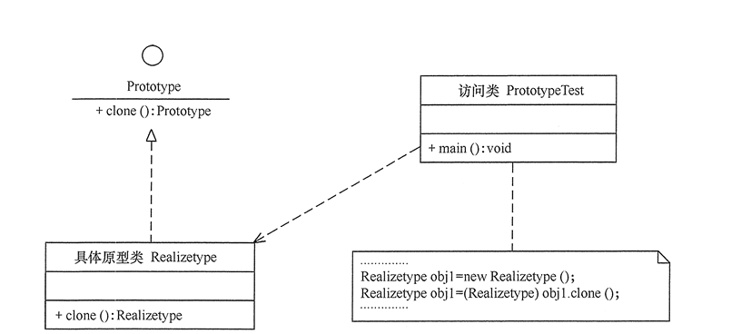

原型模式实例:[PrototypeTest](https://github.com/guang19/framework-learning/blob/dev/design_pattern/src/main/java/com/github/guang19/designpattern/prototype)

在java中，原型模式还涉及深拷贝与浅拷贝的问题，我推荐一篇写的非常好的文章建议各位同学学习:
[CSDN - Java中的clone方法 - 原型模式](https://blog.csdn.net/zhangjg_blog/article/details/18369201)


#### 代理模式(Proxy)
代理模式的意图是 为目标对象提供一种代理，用以控制客户端对于目标对象的访问。
举个栗子: 我(客户端)需要访问某个网站的服务器，但是目标网站的服务器的IP又不可能直接暴露在公网之上，
所以目标服务器通过提供代理服务器来解决这种问题。我们访问目标网站时，实际请求的是代理服务器，然后再由代理服务器
将请求转发到真正的处理任务的服务器(反向代理)，在这个过程中，代理服务器充当了保护或中介的角色，将真正的服务器隐藏了起来。

代理模式由 抽象主题，真实主题以及代理主题等要素组成:

- 抽象主题: 抽象主题声明了真实主题需要实现的接口。

- 真实主题: 真实主题就是目标对象，它需要实现抽象主题。

- 代理主题: 代理主题与真实主题一样，都需要实现抽象主题，但代理主题内部包含了真实主题，当访问代理主题的时候，
它会使用真实主题去处理，同时可以控制与扩展真实主题的功能。

  
代理模式:

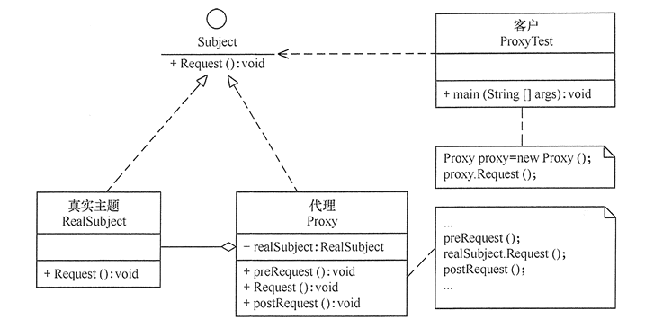

代理模式实例:
[ProxyTest](https://github.com/guang19/framework-learning/blob/dev/design_pattern/src/main/java/com/github/guang19/designpattern/proxy)


#### 适配器模式(Adapter)
适配器模式的意图是 将一个接口转换成客户希望或需要的另一个接口，使得原本由于接口不兼容而不能一起工作的那些类能一起工作。
比如一个播放器只能播放 .mp4 格式的视频，如果是 .flv 格式的视频这个播放器就不能播放了，此时我们就可以
创建一个视频适配器，将 .flv 格式的视频适配成播放器所需的格式的视频。

适配器模式实例: [AdapterTest](https://github.com/guang19/framework-learning/blob/dev/design_pattern/src/main/java/com/github/guang19/designpattern/adapter)


#### 装饰器模式(Decorator)
装饰器模式的意图是 在不改变原有系统结构的情况下，能够动态的给系统添加一些新的职责和功能。
比如我买了一辆车，我想给这辆车添加一个尾翼，添加尾翼后，并没有对原来的车身的其他地方做出修改。

装饰器模式主要由 抽象构件 ， 具体构件 ， 抽象装饰和具体装饰等要素组成:

- 抽象构件: 抽象构件定义了具体构件的职责。

- 具体构件: 具体构件实现了抽象构件，需要通过装饰器来为其拓展功能。

- 抽象装饰: 抽象装饰也实现了抽象构件，并包含了具体构件，可以通过具体装饰对其拓展功能。

- 具体装饰: 具体装饰继承了抽象装饰，并对具体构件做出扩展。

装饰器模式:

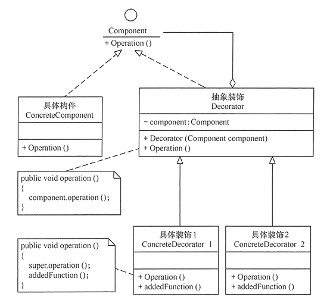

装饰器模式实例: [DecoratorTest](https://github.com/guang19/framework-learning/blob/dev/design_pattern/src/main/java/com/github/guang19/designpattern/decorator)


#### 桥接模式(Bridge)
桥接模式的意图是将抽象部分与实现部分分离，使得他们都可以独立的变化。桥接模式主要解决了在有多种变化的情况下，
泛滥使用继承的问题。某些对象具有多个方面的变化，如 有不同颜色和大小的字，有不同功率和品牌的小轿车等等。

桥接模式主要由: 抽象化角色，扩展抽象化角色，实现化角色和具体实现化角色组成：

- 抽象化角色： 抽象化角色即抽象类，它包含一个对实现化对象的引用 ，比如 字拥有对颜色的引用。

- 扩展抽象化角色： 扩展抽象化角色是对抽象化角色的扩展，比如 小字，大字，中等大小的字。

- 实现化角色： 实现化角色是定义了实现化的接口，供抽象化角色使用，如 颜色。

- 具体实现化角色： 具体实现化角色是实现化角色的实现，如 黑色，红色。

桥接模式:

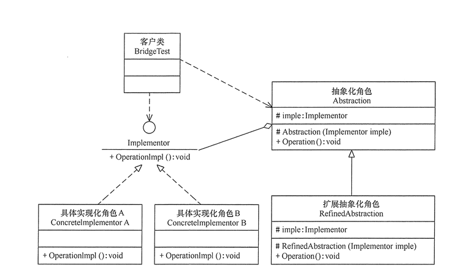

桥接模式实例: [BridgeTest](https://github.com/guang19/framework-learning/blob/dev/design_pattern/src/main/java/com/github/guang19/designpattern/bridge)


#### 组合模式(Composite)
组合模式又称为 部分-整体模式，它是一种将对象组合成树状的层次结构的模式，用来表示“部分-整体”的关系。
比如一棵树上有许多树枝，每枝树枝上又有许多树叶，这就属于层次结构，我个人倾向于把它理解为 “一对多的关系”，
如何把这种关系合理的表现出来呢？就可以使用到我们的组合模式了。

组合模式主要由： 抽象构件，树叶构件和树枝构件等要素组成：

- 抽象构件： 抽象构件声明了树叶构件和树枝构件的公共接口。

- 树枝构件： 树枝构件实现了抽象构件声明的接口，它的作用是管理和存储子部件。

- 树叶构件： 树叶构件也实现了抽象构件声明的接口，它是组合中的叶子构件，没有子部件。

组合模式实例: [CompositeTest](https://github.com/guang19/framework-learning/blob/dev/design_pattern/src/main/java/com/github/guang19/designpattern/composite)


#### 外观模式(Facade)
外观模式又被称为门面模式，外观模式的意图是通过为多个复杂的子系统提供一个一致的接口，使得这些子系统能够更容易的
被访问，客户端也不必关注内部子系统的实现细节，大大降低了应用程序的复杂度。 假设我们的某个系统有一个生成唯一ID
的接口，而生成唯一ID的方案有很多种，如雪花ID，UUID，自增ID等等，客户端只需要调用那一个生成ID的接口获取ID就行了，
无需关注这个接口到底使用的是哪种生成ID的方案。

外观模式实例：[FacadeTest](https://github.com/guang19/framework-learning/blob/dev/design_pattern/src/main/java/com/github/guang19/designpattern/facade)


#### 享元模式(Flyweight)
享元模式的意图是 运用共享技术来支持大量细粒度对象的复用，以此达到节约内存，提高系统性能的目的。
在我们的应用中，有时需要创建一些相同或具有共同部分的对象，比如拥有相同姓名的用户，具有相同分辨率的屏幕等等。

享元模式由 抽象享元角色，具体享元角色，非享元角色和享元工厂等要素组成:

- 抽象享元角色： 抽象享元角色是所有具体享元角色的基类，为具体享元角色定义公共属性和接口 ，如Person。

- 具体享元角色： 具体享元角色实现了抽象享元角色定义的规范，如Programmer,Writer，

- 非享元角色： 非享元角色是不可共享的外部状态，如Person的age，height都可能不同，就不能共享，这些可以归纳为
Person的基本信息BasicInfo

- 享元工厂：  享元工厂负责创建和管理享元角色。

享元模式：

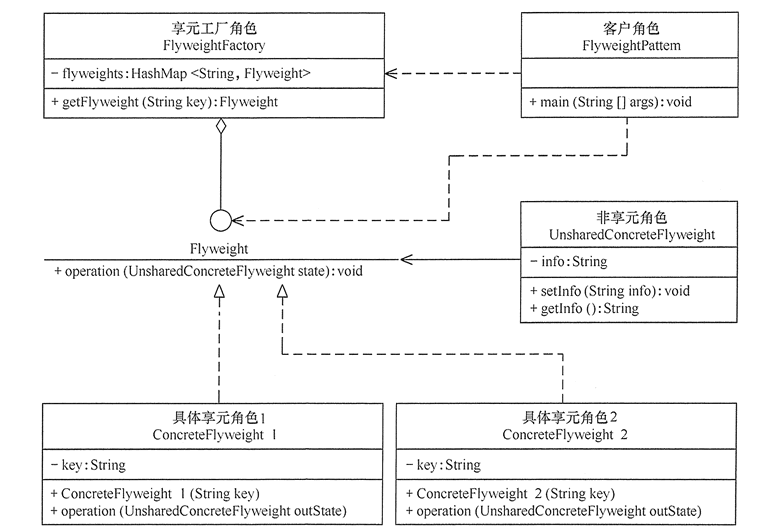

享元模式实例：[FlyweightTest](https://github.com/guang19/framework-learning/blob/dev/design_pattern/src/main/java/com/github/guang19/designpattern/flyweight)


#### 观察者模式(Observer)
观察者模式的意图是 当多个事物之间存在一种一对多关系时，如果一个事物的状态发生改变，使得依赖这个事物的其他事物也能得到
通知，并做出相应改变，观察者模式有时被称为 发布-订阅者模式 或 模型-视图模式。在我们的生活当中，一个事物影响其他事物的
例子数不胜数：我们过马路时，当交通指示灯改变颜色，我们收到这一信息，便会做出反馈，我们知道该停下还是可以过马路；
如果我们在手机上订阅了某个节目的专栏，当专栏有新的信息时，便会推送给我们；当我们按下灯的开关时，灯会被点亮或熄灭。

观察者模式由 抽象主题角色，具体主题角色，抽象观察者角色和具体观察者角色等要素组成：

- 抽象目标角色： 抽象目标角色是具体目标角色的规范，它提供了用于管理观察者角色的方法，以及定义了通知观察者的
抽象方法。

- 具体目标角色(发布者)： 具体目标角色是观察者观察的具体目标，它实现了抽象目标角色定义的规范，当具体目标发生变化时，
便会通知所有的观察者。

- 抽象观察角色： 抽象观察角色是具体观察角色的规范，声明了当目标角色发生变化时，更新自身的方法。

- 具体观察角色(订阅者)： 具体观察角色实现了抽象观察角色定义的规范，它决定了当具体目标角色发生变化时，自身需要完成的逻辑。

观察者模式:

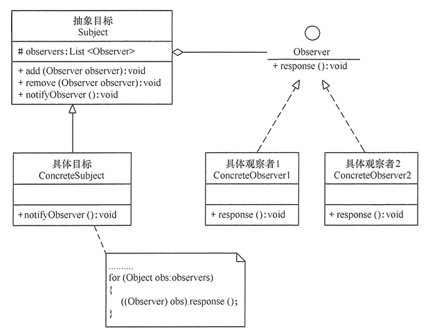

观察者模式实例：[ObserverTest](https://github.com/guang19/framework-learning/blob/dev/design_pattern/src/main/java/com/github/guang19/designpattern/observer)
   
   
#### 模板方法模式(Template Method)
模板方法模式的意图是 定义一个操作中的算法骨架，将算法的一些步骤延迟到子类中，使得子类可以在不改变整体算法框架的
前提下，重新实现该算法的某些逻辑。 比如我们的程序中有一个保存用户信息的服务，保存用户的信息假设分为两个步骤：1.校验用户信息(check)。
2.使用jdbc将用户信息存入数据库(save)。 其中将用户信息存入数据库这一步骤几乎不会发生改变，但校验用户的信息这一步就可能有不同的方案，
所以校验用户信息这一步骤可以延迟到这个服务的子类中去，由不同的子类实现不同的逻辑。

模板方法模式由 抽象模板和具体子类等要素组成：

- 抽象模板： 抽象模板定义了整个服务或者算法的整体框架，它由一个模板方法和若干基本方法组成。

  - 模板方法： 模板方法是抽象模板的核心，它定义了基本方法被调用的顺序。如保存用户信息的服务，是先check，还是先
  save，保存用户信息的模板方法就负责整合这两个方法。
  
  - 基本方法： 基本方法是整个服务或算法中的一个步骤，check和save都是基本方法，基本方法还可分为：
 
    - 抽象方法： 抽象方法在抽象模板中声明，由具体模板实现。
    
    - 具体方法： 具体方法在抽象模板中声明并实现，可以在具体模板中被重写。
    
    - 钩子方法： 钩子方法在抽象模板中声明并实现，它的方法体通常是空的，可以在具体模板中实现，
    所以钩子方法起到的是一个扩展的作用。
    
   
- 具体模板： 具体模板实现或重写了抽象模板中声明的抽象方法和钩子方法，具体的逻辑视这个具体模板的职责而定。

模板方法模式：

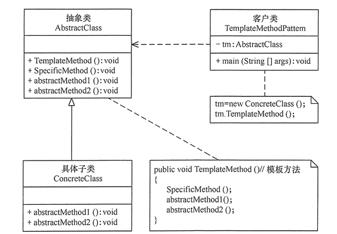

模板方法实例：[TemplateMethodTest](https://github.com/guang19/framework-learning/blob/dev/design_pattern/src/main/java/com/github/guang19/designpattern/templatemethod)

   

#### 策略模式(Strategy)
策略模式的意图是 定义一系列的算法，并将每个算法封装起来，使得它们可以相互替换，且算法的变化并不会影响到使用
该算法的客户端。 假设我要到一个地方去，有公交和地铁两种出行方式，无论选择何种方式出行，都可以使得我到目的地。
再假设我要将一个无序的序列排序成一个有序的序列，需要采用排序算法来解决问题，我可以在不同的环境下采用不同排序算法，
但无论何种排序算法其执行的结果最终肯定都是一致的。

策略模式由 抽象策略，具体策略和环境角色等要素组成：

- 抽象策略： 抽象策略声明了算法接口，各种不同的算法以不同的方式实现此接口。

- 具体策略： 具体策略实现了抽象策略，并提供了具体的算法逻辑。

- 环境角色： 环境角色持有一个策略的引用，最终客户端会使用环境角色来调用具体策略的算法。

策略模式：

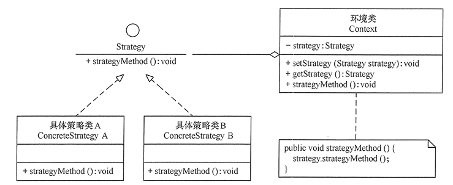

策略模式实例：[StrategyTest](https://github.com/guang19/framework-learning/blob/dev/design_pattern/src/main/java/com/github/guang19/designpattern/strategy)

   

#### 责任链模式(Chain of Responsibility)
责任链模式又被成为职责链模式，它的意图是 为了避免一个请求发送者与多个请求处理者耦合在一起， 
而将所有请求处理者连接成一条处理引用链，当有请求发送时，请求就会被这条请求处理引用链上的请求处理者处理。

责任链模式由 抽象处理者和具体处理者等要素组成：

- 抽象处理者： 抽象处理者声明了处理请求的接口， 且包含了当前处理者的下一个处理者。

- 具体处理者： 具体处理者实现了抽象处理者，当具体处理者处理完请求后，如果它还有后继处理者，那么就将请求
交予其后继处理者处理。

责任链模式：

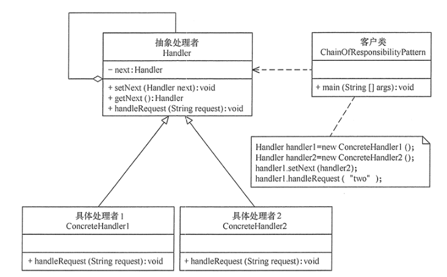

责任链请求处理流程:


责任链模式实例: [ResponsibilityChainTest](https://github.com/guang19/framework-learning/blob/dev/design_pattern/src/main/java/com/github/guang19/designpattern/responsibilitychain)


#### 中介者模式(Mediator)
中介者模式遵循迪米特法则，它的意图是 使用一个中介者对象来封装一系列对象之间的交互，使原有对象之间不需要显示的调用彼此，
从而使其耦合松散。 中介者这个角色很好理解，比如在我们使用聊天应用程序进行通信的时候，
我们发送的消息是发送给了服务器，服务器收到消息后，再将消息发送给对方。

中介者模式由 抽象中介者，具体中介者，抽象同事角色和具体同事角色等要素组成：

- 抽象中介者： 抽象中介者声明了同事对象注册与转发同事对象信息的接口。

- 具体中介者： 具体中介者实现了抽象中介者，协调各个同事之间的交互关系。

- 抽象同事角色： 抽象同事角色声明了同事之间的交互接口。

- 具体同事角色： 具体同事角色实现了抽象同事角色声明的接口，当前同事角色与其他同事交互时，需要由中介者
负责协调。

中介者模式：

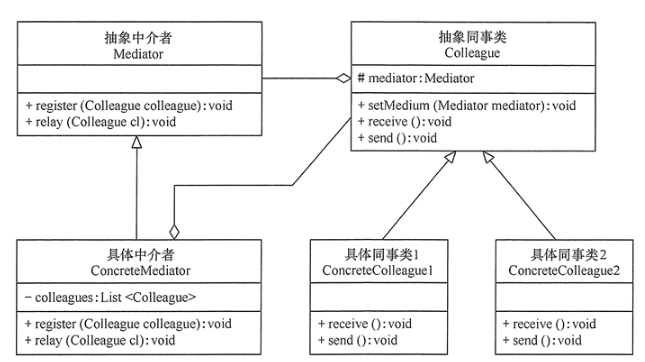


中介者模式实例： [MediatorTest](https://github.com/guang19/framework-learning/blob/dev/design_pattern/src/main/java/com/github/guang19/designpattern/mediator)


   
#### 访问者模式(Visitor)
访问者模式的意图是 将作用于某种数据结构中的各元素的操作分离出来封装成独立的类，使其在不改变数据结构的
前提下可以添加作用于这些元素的新操作，访问者模式将数据结构与操作分离，是行为模式中较为复杂的一种模式。
举个栗子： 公园(数据结构)中有多个景点(元素)，每个游客都可以访问这些景点，且对这些景点有各种不同的评价。

访问者模式由 抽象访问者，具体访问者，抽象元素，具体元素和对象结构等要素组成：

- 抽象访问者： 抽象访问者为每个具体元素都声明了访问具体它的接口。

- 具体访问者： 具体访问者实现了抽象访问者定义的接口，确定了访问一个元素时需要做的操作。

- 抽象元素： 抽象元素声明了被访问者访问的接口。

- 具体元素： 具体元素实现了抽象元素。

- 对象结构： 对象结构是包含了元素的容器，提供了让访问者访问容器中所有元素的方法，可以看作是 公园。

访问者模式：

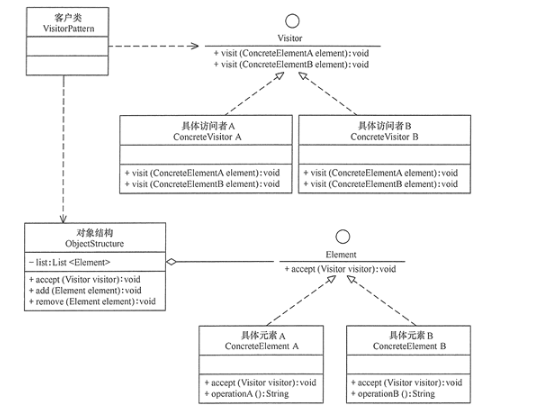

访问者模式实例： [VisitorTest](https://github.com/guang19/framework-learning/blob/dev/design_pattern/src/main/java/com/github/guang19/designpattern/visitor)


   
#### 命令模式(Command)
命令模式的意图是 将请求封装为一个对象，使发出请求的责任和执行请求的责任分离开来，请求的发送者和接受者通过命令进行
沟通。 比如当我们使用电视遥控器(命令发送者)按下某个按钮(具体命令)时，电视机(命令接受者)就会做出相应的反馈。

命令模式由抽象命令，具体命令，命令发送者和命令接受者等要素组成：

- 抽象命令： 抽象命令声明了执行命令的接口。

- 具体命令： 具体命令是抽象命令的实现，它通过调用命令接受者的功能完成命令要执行的操作。

- 命令接受者： 命令接受者不与命令发送者直接交互，而是被命令所调用执行。

- 命令发送者： 命令发送者也不直接与命令的执行者交互，而是通过调用命令来执行相关请求。 

命令模式：


命令模式实例： [CommandTest](https://github.com/guang19/framework-learning/blob/dev/design_pattern/src/main/java/com/github/guang19/designpattern/command)


#### 解释器模式(Interpreter)
解释器模式定义了 评估某种语言的**文法**，并建立一个解释器解释该语言的句子。如我们常见的SQL的解析，某种语言
的代码在执行之前也需要被解析。

解释器模式实例： [InterpreterTest](https://github.com/guang19/framework-learning/blob/dev/design_pattern/src/main/java/com/github/guang19/designpattern/interpreter)

   
#### 迭代器模式(Iterator)
迭代器模式的意图是 提供一个对象来顺序访问聚合对象中的一系列数据，而不暴露聚合对象的内部表示。

迭代器模式实例： [IteratorTest](https://github.com/guang19/framework-learning/blob/dev/design_pattern/src/main/java/com/github/guang19/designpattern/iterator)

   
#### 备忘录模式(Memento)
备忘录模式的意图是 在不破坏封装性的前提下，捕获一个对象的内部状态，并在该对象之外保存这个状态，以便以后在需要的时候
能够恢复到之前保存的状态。假设我们在更改一篇文章后，发现更改后的文章还没有更改之前好，于是就想将文章恢复到更改之前的状态，
此时就可以借助备忘录完成此需求。

备忘录模式由 备忘录，发起人和管理者等要素组成：

- 发起人： 发起人记录当前时刻的内部状态，提供创建备忘录和恢复备忘录数据的功能。

- 备忘录： 备忘录负责存储发起人的内部状态，并在需要的时候将内部状态传递给发起人。

- 管理者： 管理者负责管理备忘录，提供获取与保存备忘录的功能。

备忘录模式：

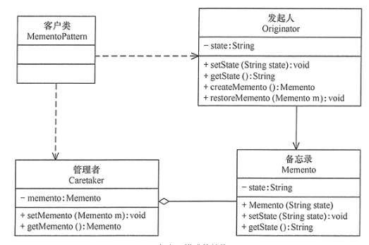

备忘录模式实例：[MementoTest](https://github.com/guang19/framework-learning/blob/dev/design_pattern/src/main/java/com/github/guang19/designpattern/memento)


#### 状态模式(State)
状态模式的意图是 使得 一个对象的状态发生改变时，这个对象的行为也随状态的变化而变化，这种对象被称为状态对象。 
举个栗子： 我们的服务器一般有start，active，destroy等状态，当服务器的状态发生改变时，其内部也需要做出相应的变化。

状态模式由 环境角色，抽象状态和具体状态等要素组成：

- 环境角色： 环境角色也被成为上下文，它维护一个当前状态，当状态发生改变时，其行为也将改变。

- 抽象状态： 抽象状态封装了环境角色在特定状态下的行为。

- 具体状态： 具体状态实现了抽象状态的行为。

状态模式：

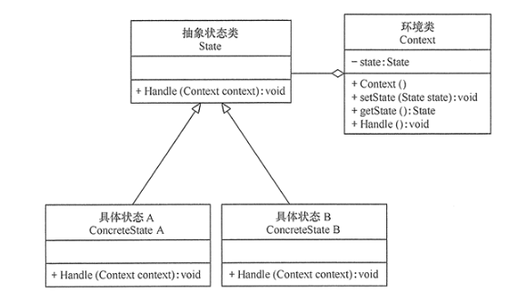


状态模式实例：[StateTest](https://github.com/guang19/framework-learning/blob/dev/design_pattern/src/main/java/com/github/guang19/designpattern/state)
