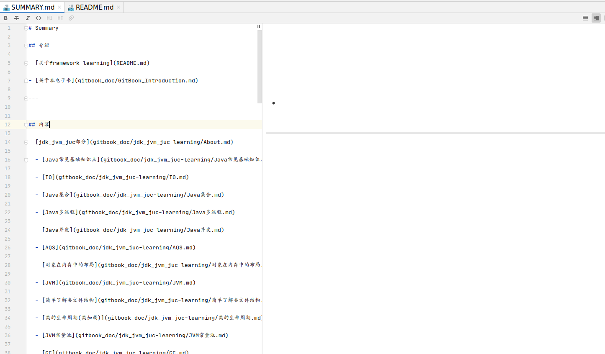
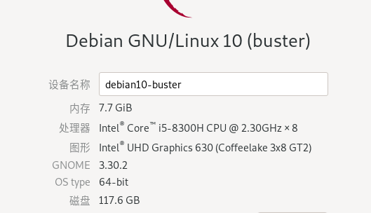
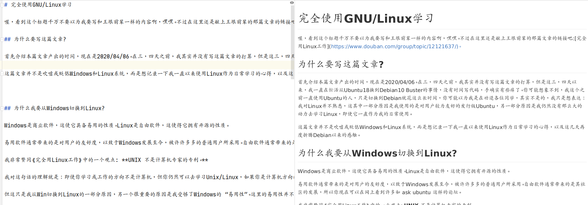
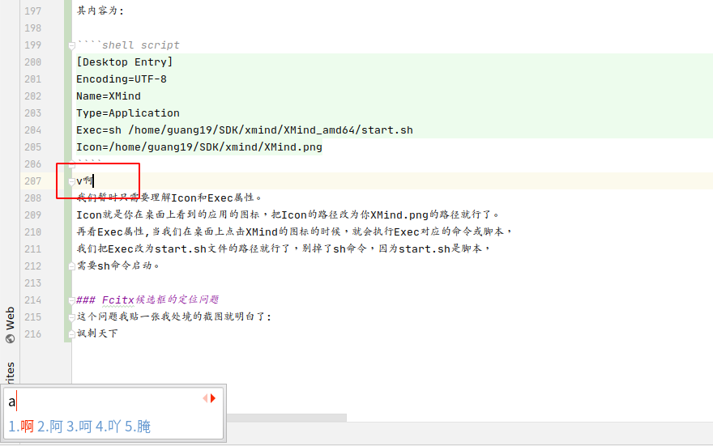

<!-- TOC -->

 * [完全使用GNU/Linux学习](#完全使用gnulinux学习)
      * [为什么要写这篇文章?](#为什么要写这篇文章)
      * [为什么我要从Windows切换到Linux?](#为什么我要从windows切换到linux)
      * [Linux作为日常使用的缺点](#linux作为日常使用的缺点)
         * [硬件驱动问题](#硬件驱动问题)
         * [软件问题](#软件问题)
      * [你真的需要完全使用Linux吗?](#你真的需要完全使用linux吗)
         * [结尾](#结尾)
      * [我使用Debian/Ubuntu时遇到的问题](#我使用debianubuntu时遇到的问题)
         * [IDEA编辑Markdown预渲染问题](#idea编辑markdown预渲染问题)
         * [wifi适配器找不到](#wifi适配器找不到)
         * [XMind安装](#xmind安装)
         * [Fcitx候选框的定位问题](#fcitx候选框的定位问题)


<!-- /TOC -->

# 完全使用GNU/Linux学习

喔，看到这个标题千万不要以为我要写和王垠前辈一样的内容啊，嘿嘿。不过在这里还是献上王垠前辈的那篇文章的链接吧:[完全用Linux工作](https://www.douban.com/group/topic/12121637/)。

## 为什么要写这篇文章?

首先介绍本篇文章产出的时间，现在是2020/04/06。在三，四天之前，我其实并没有写这篇文章的打算，但是这三，四天以来，我一直在忙活从Ubuntu18换到Debian10 Buster的事情，没有时间写代码，手确实有些痒了。你可能想象不到，我这个之前一直使用Ubuntu的人，只是切换到Debian就花这么长时间，你可能以为我是在劝退各位同学，其实不是的，我只是想表达：我对Linux并不熟悉，这其中一部分原因是我使用的是对用户较为友好的发行版Ubuntu，另一部分原因是我仍然没有那么大的动力去学习Linux，即使它一直作为我的日常使用。

这篇文章并不是吹嘘或贬低Windows和Linux系统，而是想记录一下我一直以来使用Linux作为日常学习的心得，以及这几天再度折腾Debian以来的感触。


## 为什么我要从Windows切换到Linux?

Windows是商业软件，这使它具备易用的性质。Linux是自由软件，这使得它拥有开源的性质。

易用软件通常带来的是对用户的友好度，以致于Windows发展至今，被许许多多的普通用户所采用。自由软件通常带来的是其社区的发展，所以你现在可以在网上看到许多如 ask ubuntu 这样的论坛。

我非常赞同《完全用Linux工作》中的一个观点: **UNIX 不是计算机专家的专利。**

我对这句话的理解就是：即使你学习或工作的方向不是计算机，但你仍然可以去学习Unix/Linux，如果你是计算机方向的同学，那么，你就更应该去学习Unix/Linux了。

但这只是我从Win切换到Linux的一部分原因，另一个很重要的原因是我受够了Windows的 “易用性”。这里的易用性并不是说我排斥Windows的人性化，而是因为人性化给我带来了很多学习上的困难。举个很简单的栗子：你在学习一项技术的时候，无论是否有面试造火箭的需要，你是否都会好奇想了解其原理和实现，即使你可能知道它很复杂。

**为什么你会好奇一个事物的源头？**

我个人认为的答案是：有趣的事情就在眼前，为什么不去了解它呢？

而Windows只是有趣，但它并不在“眼前”。

我个人的体验哈，不知道有没有同学和我一样的经历，在很多时候，你的Windows可能会出现一些莫名奇妙的问题，但你却不知道如何解决它，你只能求助搜索引擎，当你解决完问题后，你不会想要去了解为什么会发生这种问题，因为Windows太庞大了。

就比如: 我现在安装了Git，使用起来没有任何问题。但等到过一段时间后，Git莫名奇妙的不能使用了，明明你啥都没干。更甚之，有一些流氓问题或流氓软件不能被解决和被屏蔽。

问题出现了，总得要解决吧，所以此时你开始在互联网上查询相关问题的解决方法，如果你的运气好，那么有人可能遇到过和你出现相同的问题，你也因此可能会得到答案。不过一般的答案只是教你怎么解决的，如打开注册表，添加或删除某个key，你不会想要知道为什么做，因为对于初学者来说，当你看到注册表那么多的内容时，你只想着不出错就行了，哪还有心思去学习这玩意啊。如果你的运气不好，且并没有更换系统的打算，那么你可能会将就着使用，但此时，你的心里可能已经衍生了对Windows的厌烦情绪。

我对流氓软件的定义是：当你想让一个软件如你的想法停止运行或停止弹出广告的时候，这个软件不能或不能做的很好的达到你的要求时，这就是一个流氓软件。你也许会说，每个人都有不同的要求，软件怎么可能达到每个人的标准呢？但我指的是停止和停止弹出广告等这样最基本的诉求，如果一个软件连最基本的诉求都实现不了，又何必再使用它呢？

综上所述，我从Window切换到Linux的最主要的原因有：**学习和自由。**

是的，你不得不承认Linux是你学习计算机的非常好的环境，与C/C++天然的集成，比你在Windows上冷冰冰的安装一个IDE就开始敲起代码来，显得多了那么一点感觉。

还有一点，可能有的同学和我一样，刚接触Linux的时候，是在Windows上安装一个虚拟机环境或使用Docker来进行学习。不可否认，这确实是在Windows上学习Linux的主要途径了，但是你有没有感觉到，你在采取这种方式学习的时候，对Linux始终有种陌生感，似乎我只是在为了学习而学习。

产生这种想法的主要原因就是你没有融入到Linux环境之中，当你融入到Linux环境之中时，你不再只是需要学习那些操作命令，你会不可避免的遇到某个你从来没有接触过的问题，这个问题不是你在Windows上“丢失图标”的那种烦人问题，而可能是令你有些害怕的因为Nvidia的驱动而黑屏的问题。你也会在互联网上查询为什么会出现这种问题，但你得到的并不是“修改注册表”这种答案，而是会学习到：为什么Nvidia在Linux上会出现这种问题？我怎么做才能解决驱动问题？其他驱动是否也有类似Nvidia这种问题？ 当你解决问题后，你的电脑开始正常工作了，你便开始使用它作为你的日常使用...

关于使用Linux学习的原因的最后一点是我认为自己不够慎独，不够克制。当我使用Windows的时候，并不能完全克制住自己接触那些新鲜游戏的念头，我玩起游戏来，通常会连续很长时间，可能是一天-_-。不过我并不是说Linux上没有游戏，相反，Linux是对很多游戏的支持是很好的，你可以玩到很多游戏，但你是否会因为使用Linux对游戏不再那么执着，至少我是如此了。这一点可以归结为“使用Linux对戒游戏有帮助吧” ，哈哈。 

再谈谈自由：

我对自由的理解是：软件在你的掌控之中，你可以了解它的每一部分，你可以去到你想到达的地方，不受任何限制，这只取决于你愿不愿意。

来看看基本的Linux目录吧：


这些目录你可能有很多都不认识，但没关系，因为这就是Linux系统(大部分)所有的目录了，你稍微了解下，就知道这些目录里放的是什么文件了。

这也是我个人的体验而已，总之，Linux的自由是一种开源精神，比我描述的可大的多。至于Windows，我到现在连C盘的目录放了些什么都不太熟悉，但我并不是在贬低Windows，因为这就是Windows易用性的代价，相应的，Linux作为自由软件，它也有很多缺点。


## Linux作为日常使用的缺点

### 硬件驱动问题

硬件驱动问题一般是在安装Linux时会出现的问题，根据个人电脑配置的不同，你的电脑的硬件驱动可能与要安装的Linux发行版不兼容，导致系统出现相应的问题。我这几天对驱动问题最深刻的体会就明白了为啥Linus大神会吐槽: “Nvidia Fuck You”。很多驱动厂商对Linux系统是闭源的，你可以下载这些厂商的驱动，但是能不能用，或者用起来有什么毛病都得你自己买单。

随着Linux开始在普通用户中变得流行起来，我相信今后Linux的生态会发展的越来越好，且现在很多Linux发行版对各种硬件的兼容性也越来越好，就以我之前使用的Ubuntu18来说，Nvidia，Wifi，蓝牙等驱动使用都是没啥问题的。我现在使用的Debian10 Buster对Nvidia的支持可能还不是那么好，使用起来总有一些小毛病，不过无伤大雅，其实没毛病我还有点不适应，不是说Debian是Ubuntu的爸爸吗，哈哈。


### 软件问题

不得不承认的一点是Linux的软件生态确实没有Windows那么丰富，你在考虑切换系统之前，必须先调查清楚Linux上是否有你必需的软件，你所需的软件是否支持跨平台或者是否有可替代的应用。我个人对软件要求较为简单，大部分都是生产力工具，其他的应用如娱乐软件之类的都可以使用网页版作为替代。如果你在Linux系统上想尝试游戏的话，我认为也是OK的，因为我也尝试过Linux Dota2 ，体验非常好(不是广告-_-)。不过大多数国内游戏厂商对Linux的支持都是很差的，所以如果过不了这道坎，也不要切换系统了。

软件问题其实可以分为2部分看待，一部分就是刚刚介绍过的生态问题，另一部分就是当你在使用某些软件的时候，总会出现某些小Bug。

就以Fcitx来说，Fcitx是一款通用的Linux输入法框架，被称为小企鹅输入法，很多输入法都是在Fcitx之上开发的，如搜狗，Googlepinyin，Sunpinyin等。使用过Fcitx的同学可能会遇到这种问题：当你在使用Fcitx在某些软件上打字时，候选框并不会跟随你光标的位置，而是总会固定在某一个位置，并且你无法改变，这个问题是我目前见过的最大Bug。不过这个Bug只在部分软件上有，在Chrome，Typora上都没有这个问题，这让我怀疑是软件的国际化问题，而非Fcitx问题。

所以第二个部分总结起来就是某些软件可能会出现某些未知的Bug，你得寻求解决的办法，或者忍耐使用，使用Linux也是得牺牲一些代价的。


## 你真的需要完全使用Linux吗?

说到这里，其实我想借用知乎某位前辈的话来表达一下我的真实想法: “**Linux最好的地方在与开放自由，最大的毛病也是在这里。普通人没有能力去选择，也没有时间做选择。透明就一定好么？也有很多人喜欢被安排啊！**“ ([知乎 - 汉卿](https://www.zhihu.com/question/309704636))

就像我开头说过的: “我对Linux并不熟悉，这其中一部分原因是我使用的是对用户较为友好的发行版Ubuntu，另一部分原因是我仍然没有那么大的动力去学习Linux，即使它一直作为我的日常使用。”

我完全使用Linux是为了学习和自由，我确实在Linux上感受到了自由，且学到了很多东西，但我却一直沉溺在这种使用Linux带来的满足感之中，并不能真正理解Linux给我们带来的到底是什么。

这次从Ubuntu切换到Debian的原因是我想尝试换个新的环境，但是当我花了3，4天后，我明白了：我只是呆在一个地方久了，想换个新地方而已，但老地方不一定坏，因为我都没怎么了解过这个老地方，就像当初我从Windows换到Linux那样，我都没有深入的了解过Windows就换了，那一段时间我还抱怨Windows的各种缺点，现在看来，非常可笑。


#### 结尾

一文把想说的话几乎都给说了，个人文笔有限，且本文主观意识太强，如果觉得本文不符合您的胃口，就当看个笑话吧。


---

## 我使用Debian/Ubuntu时遇到的问题

**以下内容是我在Debian10 Buster下遇到的问题以及相关解决办法，
使用Ubuntu和Debian其他版本的同学也可借鉴。**

PS:欢迎各位同学在此处写下你遇到的问题和解决办法。

### IDEA编辑Markdown预渲染问题
这个问题花了我很长时间。

当我安装IDEA后，使用它编辑markdown文件的时候，就出现了如下图所示的情况:



你可以看到右边渲染的画面明显有问题。刚开始的时候我一度怀疑是IDEA版本的问题，
于是我又安装IDEA其他版本，但也没有任何作用，这时我怀疑是显卡的原因:



可以看到使用的是Intel的核显，于是当我查询相关资料，使用脚本将核显换为了独显，这里没留截图，当你换到独显后，
图形会显示独显的配置，使用nvidia-smi命令可以查看独显使用状态。
于是我满怀期待的打开IDEA，但还是无济于事。当我以为真的是Debian的Bug的时候，
我又发现Bumblebee可以管理显卡，何不一试？于是我安装Bumblebee后，使用optirun命令启动IDEA，没想到啊，
还真是可以:



我真的就很奇怪，同样是使用了独显，为什么optirun启动就可以正常显示。
于是我后来又查询optirun是否开启了gpu加速，但很可惜，我并没有得到相关答案，不过这让我确定了这个问题出现在
显卡上。如果有知道原因的同学，敬请告之，感激不尽。


### wifi适配器找不到
我猜(不确定)这个问题应该发生在大多数使用联想笔记本的同学的电脑上，不止Debian，且Ubuntu也有这个问题。
当安装完系统后，我们打开设置会发现wifi一栏显示 “wifi适配器找不到” 此类的错误信息。
这个问题的大概原因是：无线网络适配器被阻塞了，需要手动将电脑上的wifi开关打开，而在我的笔记本上并wifi开关，
所以可以猜测是联想网络驱动的问题。
可以使用 rfkill list all命令查询你的wlan是否被阻塞了，没有此命令的同学可以使用

````text
sudo apt-get install rfkill
````

安装，当wlan显示Hard blocked: true , 就证明你的无线驱动被阻塞了。
解决办法是将阻塞无限驱动的那个模块从内核中移除掉，直接在 /etc/modprobe.d
目录下编辑 blacklist.conf文件，其内容为:

````text
blacklist ideapad_laptop
````

文件名不一定要与我的一致，但是要以.conf结尾。
你可以将modprobe.d目录下的文件理解为黑名单文件，
当Linux启动时就不会加载conf文件指定的模块，
这里的 <ideapad_laptop> 就是我们需要移除的那个无线模块。

**后遗症：
当我们移除 <ideapad_laptop> 模块后，以后开启的时候，有时会出现
蓝牙适配器找不到的情况,之前在Ubuntu上却并未发现这种问题，
看来Debian在驱动方面没有Ubuntu做的好，不过这也是可以理解的，
毕竟大多数时候还是可以正常使用的-_-。**


### XMind安装
XMind是使用Java编写的，依赖于Openjdk8。所以在Linux上使用XMind，
首先需要有Openjdk8的环境。
其次启动的时候需要编写Shell脚本来启动，没想到吧，我也没想到，
这也是我趟过很多坑才玩出来的。

首先我们需要准备一张XMind的软件启动图片，
这个我已经放到[目录](https://github.com/guang19/framework-learning/tree/dev/img/linux)
下了,需要的同学请自取。

其次我们进入XMind_amd64目录下，32位系统的同学进入XMind_i386目录，
我们创建并编辑 start.sh 脚本，其内容为:

````text
#!/bin/bash
cd /home/guang19/SDK/xmind/XMind_amd64 (这个路径为你的XMind脚本的路径)
./XMind
````

这个脚本的内容很简单吧，当启动脚本的时候，进入目录，直接启动XMind。

脚本写完后需要让它能够被执行，使用

````text
chmod +x start.sh
````

命令给予start.sh被执行的权限。

此时你可以尝试执行 ./start.sh 命令来启动XMind，启动成功的话，
就已经完成了99%了，如果启动不成功，可以再检测下前面的步骤是否有误。

如果以后你只想用Shell启动XMind的话，那么到此也就为止了，连上面所说的图片都不需要了。
如果你想更方便的启动的话，那么就需要创建桌面文件启动。
在Debian/Ubuntu下，你所看到的桌面文件，都存储在 /usr/share/applications
目录下面，这个目录下文件全是以.desktop结尾。
我们现在就需要在这个目录下创建xmind.desktop文件(名字可以不叫xmind)。

其内容为:

````text
[Desktop Entry]
Encoding=UTF-8
Name=XMind
Type=Application
Exec=sh /home/guang19/SDK/xmind/XMind_amd64/start.sh
Icon=/home/guang19/SDK/xmind/XMind.png
````

我们暂时只需要理解Icon和Exec属性。
Icon就是你在桌面上看到的应用的图标，把Icon的路径改为你XMind.png的路径就行了。
再看Exec属性,当我们在桌面上点击XMind的图标的时候，就会执行Exec对应的命令或脚本，
我们把Exec改为start.sh文件的路径就行了，别掉了sh命令，因为start.sh是脚本，
需要sh命令启动。


### Fcitx候选框的定位问题
这个问题我贴一张我处境的截图就明白了:



可以看到我的光标定位在第207行，但是我输入法的候选框停留在IDEA的左下角。
为什么我要说停留在IDEA的左下角？因为就目前我的使用而言，这个问题只在IDEA下存在，
不仅是Debian，Ubuntu也存在这种问题，我个人认为这应该是IDEA的问题，
查到的相关文章大部分都是说Java Swing的问题，看来这个问题还真是比较困难了。
如果有同学知道解决办法，还请不吝分享，非常感谢。