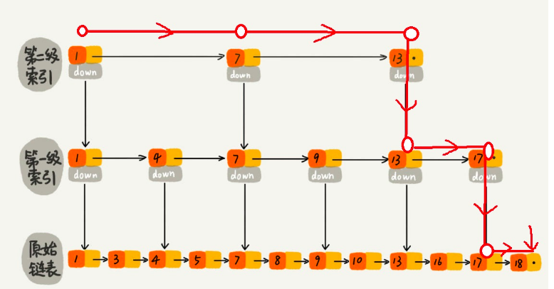

<!-- TOC -->

  * [java集合](#java集合)
      * [线程不安全的集合](#线程不安全的集合)
         * [HashMap的特点](#hashmap的特点)
         * [HashMap的长度(容量)为什么要设计成2的幂？](#hashmap的长度容量为什么要设计成2的幂)
         * [HashTable的特点](#hashtable的特点)
         * [TreeMap](#treemap)
         * [ArrayList的特点](#arraylist的特点)
         * [Vector的特点](#vector的特点)
         * [LinkedList的特点](#linkedlist的特点)
         * [Set](#set)
         * [ConcurrentModificationException异常](#concurrentmodificationexception异常)
      * [线程安全的集合](#线程安全的集合)
         * [线程安全的 List](#线程安全的-list)
         * [CopyOnWriteArrayList](#copyonwritearraylist)
         * [线程安全的Set](#线程安全的set)
         * [线程安全的Map](#线程安全的map)
         * [ConcurrentHashMap](#concurrenthashmap)
         * [ConcurrentSkipListMap](#concurrentskiplistmap)

<!-- /TOC -->


# java集合

### 线程不安全的集合

#### HashMap的特点
- HashMap在Jdk8之前使用拉链法实现,jdk8之后使用拉链法+红黑树实现。

- HashMap是线程不安全的,并允许null key 和 null value。

- HashMap在我当前的jdk版本(11)的默认容量为0,在第一次添加元素的时候才初始化容量为 16,
之后才扩容为原来的2倍。

- HashMap的扩容是根据 threshold决定的 : threshold = loadFactor * capacity。 
  当 size 大于 threshold 时,扩容。

- **当某个桶的元素数量达到指定的阈值TREEIFY_THRESHOLD(8)时，HashMap会判断当前数组的
长度是否大于MIN_TREEIFY_CAPACITY(64),如果大于，那么这个桶的链表将会转为红黑树，否则HashMap将会扩容。
当某个桶的红黑树节点的数量小于等于指定的阈值UNTREEIFY_THRESHOLD(6)时，那么在扩容的时候，这个桶的红黑树将转为链表。**


#### HashMap的长度(容量)为什么要设计成2的幂？
一个对象的hashcode是很大的，想想看：当HashMap的容量仅为16，32时，
如何根据hashcode来确定key在数组中的下标？
一个好的办法就是取余: hashcode % length。
这样就能确保，key的下标是永远不会超过数组的长度。
但是，除了取余有没有更好的办法？

当然有:
````text
hash % length == hash & (length - 1)
````

上面这个性能超高的等式**只有当length为2的幂的时候这样的等式才成立,**
这就明白了为什么使用2的幂来定义HashMap的长度。


#### HashTable的特点
- HashTable底层使用拉链法实现。

- HashTable就像Vector一样,也是jdk1就存在的很古老的一个类，它是线程安全的，
实现线程安全的手段是使用synchronized。

- HashTable的默认容量为16，每次扩容为原来的2倍+1。

- HashTable不允许null key 和 null value。

#### TreeMap

**TreeMap使用红黑树实现,不允许null key,允许自然排序Comparable和比较器Comparator排序。**
  
#### ArrayList的特点
- ArrayList底层使用Object数组实现。

- ArrayList的容量默认为0,只有在第一次执行add操作时才会初始化容量为10，正常的扩容是为原来的1/2倍。

- 由于ArrayList采用数组实现,它的容量是固定的,所以当添加新元素的时候,如果超出了数组的容量,
那么此时add操作的时间复杂度将会是O(n-1)。

- ArrayList实现了RandomAccess接口，该接口没有具体的规范，只是一个标记，
这代表ArrayList支持快速的随机访问。

- ArrayList在内存空间利用率上肯定是不如LinkedList的，
因为数组是一片固定的连续的内存空间，一旦分配就无法改变，
所以难免会有空间不足或空间使用率很低的情况。

#### Vector的特点
1. ArrayList是线程不安全的，Vector是线程安全的，
但Vector实现线程安全的手段是synchronized。这就好比HashMap与HashTable的区别。

2. Vector默认容量为10。

3. Vector是当它的扩容增量大于0时，会扩容为原来的容量+扩容增量，否则扩容为原来的2倍。

#### LinkedList的特点
- LinkedList底层使用**双端链表**实现。

- LinkedList的add操作只需要改变尾节点的引用就行了。
  但是如果需要在指定位置进行add操作的话，那么时间复杂度也是比较高的,为O(n)，
  因为需要从头节点或尾节点遍历到需要操作的节点。

- LinkedList的空间利用率虽然很高，但是它的每个Node可以说也是占用了较大空间的，
  因为每个Node需要保存它的前继和后继节点。

**PS: 双端链表与双向链表的区别:
双端链表:每个Node都保存了前后2个节点的引用，双向链表的first节点的前一个节点为null,
 last节点的后一个节点为null。**

**双向链表: 每个Node都保存了前后2个节点的引用，
双向链表的first节点的前一个节点指向last节点，
last节点的最后一个节点指向first节点。**
 
#### Set
为啥不单独说HashSet，我目前看到的JDK所有的Set,都是使用Map实现的,
除了CopyOnWriteArraySet(底层是CopyOnWriteArrayList)。

TreeSet --> TreeMap

LinkedHashSet --> LinkedHashMap

HashSet --> HashMap

ConcurrentSkipListSet --> ConcurrentSkipListMap

Set是如何保证元素不会重复,这个得看各自Map的实现了。

拿HashMap来讲，它先判断key的hash是否相等，然后才使用equals判断2个对象是否相等。


#### ConcurrentModificationException异常  
ConcurrentModificationException可以从名字看出是并发修改的异常。

但我要说的是**这个异并不是在修改的时候会抛出的，而是在调用迭代器遍历集合的时候才会抛出。**

而集合类的大部分toString方法，都是使用迭代器遍历的。**所以如果多线程修改集合后，
接着就遍历集合，那么很有可能会抛出ConcurrentModificationException。**

**在ArrayList，HashMap等非线程安全的集合内部都有一个modCount变量，
这个变量是在集合被修改时(包括删除，新增)，都会被修改。**

如果是多线程对同一个集合做出修改操作，那么最终在调用集合的迭代方法时，
modCount与预期expectedModeCount比较，expectedModCount是在迭代器初始化时使用modCount赋值的，
**如果发现modCount与expectedModeCount不一致，就说明在使用迭代器遍历集合期间，
有其他线程对集合进行了修改,所以就会抛出ConcurrentModificationException异常。**


### 线程安全的集合

#### 线程安全的 List
1. 使用集合工具类Collections的 synchronizedList把普通的List转为线程安全的List.(不推荐)
2. 使用Vector.(不推荐)
3. 使用CopyOnWriteArrayList,推荐使用此种方法，因为以上2种方法全部都是单纯的Synchronized加锁
 
#### CopyOnWriteArrayList
CopyOnWriteArrayList是线程安全的ArrayList，可以被称为写时复制的ArrayList。
CopyOnWriteArrayList底层仍然使用数组实现，
但是它的修改操作(增删改)采用synchronized关键字保证并发的安全性，
然后**在进行修改的时候复制原来的数组到一个新副本，对新副本进行修改，修改完后再设置原数组。**
这样就不会让写操作影响读操作了。 

**但是CopyOnWriteArrayList不容忽视的缺点就是修改操作比较消耗内存空间，所以它适用于读多写少的环境。**
  
#### 线程安全的Set
1. 使用集合工具类的Collections的synchronizedSet把普通的set转为线程安全的set(不推荐)
2. 使用CopyOnWriteArraySet,此set适用于读多写少的情况，它的底层采用CopyOnWriteArrayList实现.
3. 使用ConcurrentSkipListSet，底层采用ConcurrentSkipListMap实现
  
#### 线程安全的Map
1. 使用集合工具类Collections的synchronizedMap把普通map转为线程安全的map(不推荐)
2. HashTable(不推荐)
3. 使用ConcurrentHashMap(常用)
4. ConcurrentSkipListMap(跳表map,推荐)

#### ConcurrentHashMap
ConcurrentHashMap使用数组+链表/红黑树实现,其扩容机制与HashMap一样。

**但是ConcurrentHashMap控制并发的方法改为了CAS+synchronized,
synchronized锁的只是链表的首节点或红黑树的首节点。**

**PS:我只看了常用的put,get,remove等核心方法的源码.
整个ConcurrentHashMap的实现用"复杂"来形容一点也不为过,
你只要想到它内部有52个内部类就知道有多复杂了,但如果不考虑并发CAS这部分，
ConcurrentHashMap和普通的HashMap的差别是不大的。**

#### ConcurrentSkipListMap
ConcurrentSkipListMap是基于跳表这种数据结构实现的。
跳表比较特殊，它由多个层次的链表组成，每层链表又有多个索引节点连接，
每层链表的元素也都是有序的。处于上层索引的链表都是下层链表的子集。
跳表与普通链表相比查找元素的效率更高。


