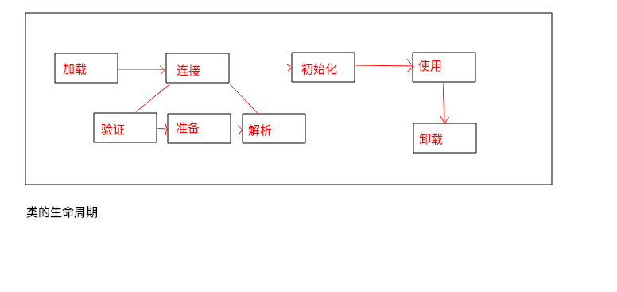

<!-- TOC -->

   * [类的生命周期](#类的生命周期)
       * [类加载过程](#类加载过程)
       * [加载](#加载)
       * [连接](#连接)
       * [初始化](#初始化)
       * [使用](#使用)
       * [类的卸载](#类的卸载)
       * [Java中类加载器有多少个](#java中类加载器有多少个)
       * [类加载器的命名空间](#类加载器的命名空间)
       * [双亲委派机制](#双亲委派机制)
       * [为什么需要双亲委派机制?](#为什么需要双亲委派机制)
       * [双亲委派机制的实现原理?](#双亲委派机制的实现原理)

<!-- /TOC -->

# 类的生命周期

当java源代码文件被javac编译成class文件后，并不能直接运行，
而是需要经过加载，连接和初始化这几个阶段后才能使用。
在使用完类或JVM被销毁后，JVM会将类卸载掉。

#### 类加载过程

类加载过程需要经过3个阶段:

1. 加载
2. 连接
3. 初始化

其中连接又可分为3个阶段: 验证 ， 准备 ， 解析。

#### 加载

**在加载阶段，类加载器将类的class文件的二进制数据读取到内存，
并保存到方法区，并在堆区生成该类的Class对象。**

通常有多种方式可以获取类的二进制数据:

* 通过javac编译器编译java源文件，读取在本地磁盘上生成的class文件。
* 从Jar，ZIP等归档文件中读取class文件。
* 通过网络读取类的字节流。
* 通过动态生成字节码的技术(如使用动态代理，cglib)来生成class。

**PS:数组由数组元素的类型的类加载器在java程序运行时加载，这是ClassLoader类的部分注释:**

**见: [测试](https://github.com/guang19/framework-learning/blob/master/jdk-jvm-juc/src/main/java/com/github/guang19/jvm/classloader/ArrayClassLoaderTest.java)**

#### 连接

1.验证
**验证阶段是为了确保类的字节流符合虚拟机规范，并且不会对虚拟机造成恶意损害。**
JVM会对字节流进行如下验证:

- 文件格式验证:会验证class文件是否符合虚拟机规范，如是否以0×CAFEBABE开头，
主次版本号是否在虚拟机规定范围类，常量池中的类型是否有JVM不支持的类型。

- 元数据验证: 会对类的元信息进行语义分析，确保符合Java语法规范。

- 字节码验证: 通过分析数据流和控制流，确保类的方法体的程序语义是合法的，
符合逻辑的。

- 符号引用验证: 确保常量池中的符号引用能在解析阶段正常解析。

2.准备: 准备阶段会为类的静态变量初始化零值，如(0,0L,null,false).

3.解析: 解析阶段会将常量池中的符号引用转为直接引用。
符号引用包括类的全限定名，方法名和描述符，字段名和描述符。  
直接引用是指向目标的指针，可以简单理解为目标的内存地址。

#### 初始化
>初始化阶段是类加载过程的最后一个阶段。

在这个阶段,**只有主动使用类才会初始化类，总共有8种情况会涉及到主动使用类。**

1. 当jvm执行new指令时会初始化类，即当程序创建一个类的实例对象。
2. 当jvm执行getstatic指令时会初始化类，即程序访问类的静态变量(不是静态常量，常量归属于运行时常量池)。
3. 当jvm执行putstatic指令时会初始化类，即程序给类的静态变量赋值。
4. 当jvm执行invokestatic指令时会初始化类，即程序调用类的静态方法。
5. 当使用反射主动访问这个类时,也会初始化类,如Class.forname("..."),newInstance()等等。
6. 当初始化一个子类的时候，会先初始化这个子类的所有父类，然后才会初始化这个子类。
7. 当一个类是启动类时，即这个类拥有main方法，那么jvm会首先初始化这个类。
8. MethodHandle和VarHandle可以看作是轻量级的反射调用机制，而要想使用这2个调用，
就必须先使用findStatic/findStaticVarHandle来初始化要调用的类。

**PS:见:[测试](https://github.com/guang19/framework-learning/blob/master/jdk-jvm-juc/src/main/java/com/github/guang19/jvm/classloader/LoadClass.java)**

#### 使用
在类被初始化完成后，就可以使用类了。

#### 类的卸载
类被卸载(Class对象被GC掉)需要满足3个条件:

1. 该类的实例对象都已被GC，也就是说堆中不存在该类的实例对象。
2. 该类没有在其它任何地方被使用。
3. 加载该类的类加载器实例已被GC。

**在JVM的生命周期中，被JVM自带的类加载器所加载的类是不会被卸载的。
而被我们自定义的类加载器所加载的类是可能会被卸载的。**

其实只要想通一点就好了，**jdk自带的BootstrapClassLoader，
PlatformClassLoader和AppClassLoader负责加载jdk提供的类，
它们(类加载器)的实例肯定不会被回收，其中BootstrapClassLoader在java中更是不能被获取到。
而我们自定义的类加载器的实例是可以被GC掉的，
所以被我们自定义类加载器加载的类是可以被GC掉的。**

**PS:使用-XX:+TraceClassUnloading 或 -Xlog:class+unload=info可以打印类卸载的信息。**

#### Java中类加载器有多少个
1. BootstrapClassLoader(用于加载Java基础核心类库。由c/c++编写，Java获取不到)。
2. PlatformClassLoader
(jdk9之后才有此类加载器，jdk8之前是扩展加载器ExtensionClassLoader
。PlatformClassLoader加载平台相关的模块，ExtensionClassLoader加载jdk扩展的模块)。
3. AppClassLoader。(应用程序类加载器，负责加载我们程序的classpath下的jar和类)。
4. 自定义类加载器。

#### 类加载器的命名空间
**每个类加载器实例都有自己的命名空间，命名空间由该加载器及其所有父加载器加载的所有的类组成。**

- 在同一个命名空间中(**一个类加载器实例**)，不会出现全限定名(包括包名)相同的2个类(**不会加载2个相同名称的类**)。

- 在不同的命名空间中(**多个类加载器实例**)，可能会出现全限定名(包括包名)相同的2个类(**可能加载2个相同名称的类**)。

**PS:见:[测试](https://github.com/guang19/framework-learning/blob/master/jdk-jvm-juc/src/main/java/com/github/guang19/jvm/classloader/MyClassLoader.java)**

#### 双亲委派机制

#### 为什么需要双亲委派机制?
**双亲委派机制是为了防止类被重复加载，避免核心API遭到恶意破坏。**
如Object类，它由BootstrapClassLoader在JVM启动时加载。
如果没有双亲委派机制，那么Object类就可以被重写，其带来的后果将无法想象。

#### 双亲委派机制的实现原理?
每个类都有其对应的类加载器。

双亲委派机制是指在加载一个类的时候，JVM会判断这个类是否已经被其类加载器加载过了。
如果已经加载过了，那么直接返回这个类。
**如果没有加载，就使用这个类对应的加载器的父类加载器判断，
一层一层的往上判断，最终会由BootstrapClassLoader判断。**
如果BootstrapClassLoader判断都没有加载这个类,
**那么就由BootstrapClassLoader尝试加载。
如果BootstrapClassLoader加载失败了，
就由BootstrapClassLoader的子类加载器们加载。**

**在jdk9之后，由于模块化的到来，双亲委派机制也变化了一点:
如果类没有被加载，那么会根据类名找到这个类的模块。
如果找到了这个类的模块，
就由这个类的模块加载，否则仍然使用父类加载器加载。**

可以看出:在加载一个类时，是由下自上判断类是否被加载的。如果类没有被加载，
就由上自下尝试加载类。