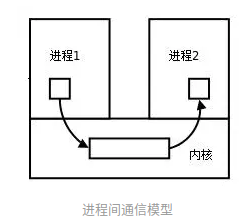
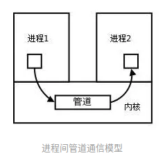
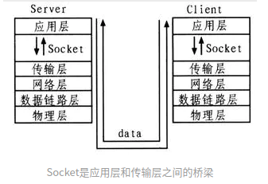
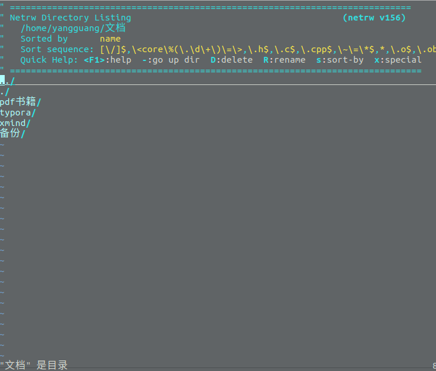
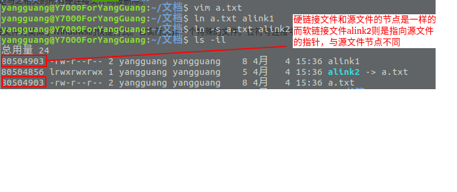
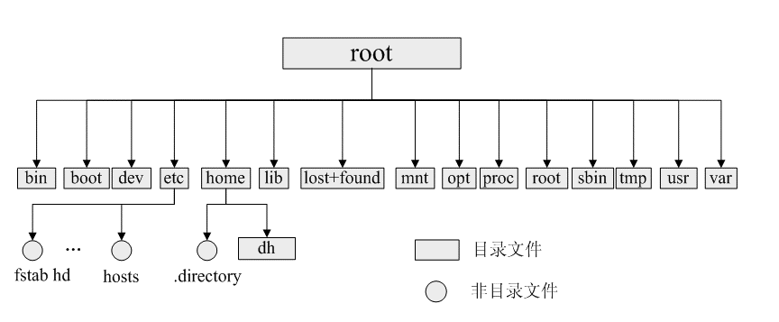
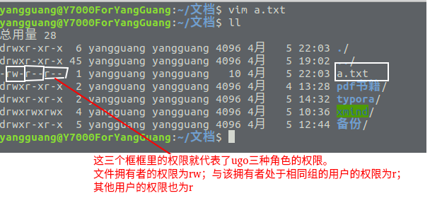
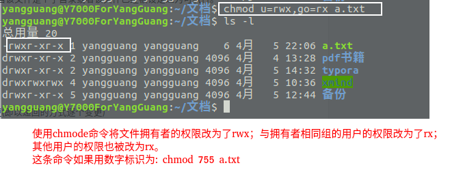
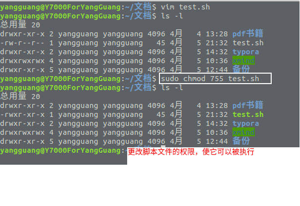
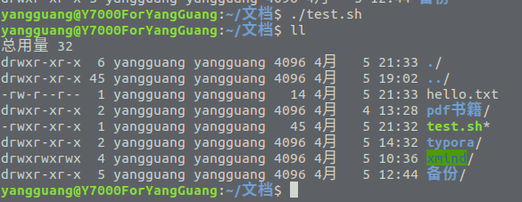

<!-- TOC -->

   * [Linux](#linux)
      * [Linux是什么?](#linux是什么)
         * [Linux与Unix的区别](#linux与unix的区别)
            * [Linux起源](#linux起源)
            * [GNU代表了什么?](#gnu代表了什么)
      * [操作系统的内核](#操作系统的内核)
         * [Linux内核](#linux内核)
            * [操作系统的用户态与内核态](#操作系统的用户态与内核态)
            * [为什么要有用户态与内核态?](#为什么要有用户态与内核态)
            * [用户态切换到内核态的几种方式](#用户态切换到内核态的几种方式)
            * [物理内存RAM(Random Access Memory 随机存储器)](#物理内存ramrandom-access-memory-随机存储器)
            * [虚拟内存(Virtual Memory)](#虚拟内存virtual-memory)
            * [Swap交换空间](#swap交换空间)
      * [进程间通信](#进程间通信)
         * [什么是进程间通信(InterProcess Communication)?](#什么是进程间通信interprocess-communication)
         * [进程间通信的方式](#进程间通信的方式)
            * [管道/匿名管道](#管道匿名管道)
            * [命名管道](#命名管道)
            * [信号](#信号)
            * [信号量](#信号量)
            * [消息队列](#消息队列)
            * [共享内存](#共享内存)
            * [Socket套接字](#socket套接字)
      * [Linux文件系统](#linux文件系统)
         * [Inode](#inode)
            * [Inode是什么?有什么作用?](#inode是什么有什么作用)
         * [文件类型](#文件类型)
            * [普通文件](#普通文件)
            * [目录文件](#目录文件)
            * [链接文件](#链接文件)
            * [设备文件](#设备文件)
            * [管道文件](#管道文件)
            * [Socket套接字文件](#socket套接字文件)
         * [Linux目录树](#linux目录树)
            * [Linux常见目录说明](#linux常见目录说明)
      * [Linux用户权限](#linux用户权限)
         * [chmod权限模式](#chmod权限模式)
            * [使用chmode更改文件权限](#使用chmode更改文件权限)
      * [Linux运行级别](#linux运行级别)
      * [shell](#shell)
         * [什么是shell?](#什么是shell)
            * [shell种类](#shell种类)
            * [第一个shell脚本](#第一个shell脚本)
      * [Linux命令大全](#linux命令大全)

<!-- /TOC -->

# Linux

`````text
Linux博大精深，操作系统更是奥妙无穷，仅仅靠我入门不久学习的知识和这一篇略显苍白的描述，
肯定是无法将Linux的知识讲述清楚的。
因此希望各位同学看本篇文章的时候，一定要抱着批评的态度阅读。
我更希望各位同学已经是对Linux有一定了解了再来阅读本篇文章，
这样你可以更加清楚本篇文章的不当之处。
`````

## Linux是什么?
Linux是一个自由的类Unix操作系统。
Linux遵循GNU(GPL)许可证，并且Linux的很多系统软件和库都是由GNU项目支持的。
Linux支持多用户，多任务，多线程，多cpu等众多特性。

### Linux与Unix的区别
- 开源与闭源: Linux是开源的；Unix则是对源代码实行知识产权保护的商业软件，这也应该是它们最大的区别。

- 硬件兼容: Unix系统大多都有与之配套的硬件；Linux则可以运行在多种硬件平台上。

#### Linux起源
在Unix系统被发明之后，广受追捧,各大科技公司都纷纷研究自己的Unix系统。
后来由于Unix的商业化和闭源，一位叫Richard Stallman的大叔就提出了自由软件精神，
发起了GNU项目，旨在开发出一款开源的类Unix的系统。
于是各个拥有开源精神的大牛们响应号召，为GNU添砖加瓦，开发了各种应用程序,如核心的gcc,glibc。
但最终由于GNU系统缺少系统内核而一直没有完成，此时一位叫Linus的同学就在Unix系统的启发下开发出了Linux内核，
并遵循GPL开源证书，顺理成章的，各位大牛把GNU与Linux一起打包发布为:GNU/Linux。
所以Linux不应该被单纯的认为是Linux内核，而是GNU / Linux。

#### GNU代表了什么?
GNU代表的是一种追求自由的精神，让用户享有对软件的源代码阅读，
修改的权利。软件公司也可以靠提供服务和训练来盈利。


## 操作系统的内核

操作系统的内核是操作系统的核心部分。
它负责系统的内存管理，硬件设备的管理，文件系统的管理以及应用程序的管理。

**图源:
[简书](https://www.jianshu.com/p/85e931636f27) (如有侵权,请联系俺,俺会立刻删除)**

### Linux内核
我们常说的Linux，其实是指基于Linux内核开发的操作系统。
常见的Linux系统发行版有:Debian,RedHat,Ubuntu,Suse,Centeos等等。

#### 操作系统的用户态与内核态

unix与linux的体系架构：分为用户态与内核态。
用户态与内核态与内核态是操作系统对执行权限进行分级后的不同的运行模式。


#### 为什么要有用户态与内核态?
在cpu的所有指令中，有些指令是非常危险的，如果使用不当，将会造成系统崩溃等后果。
为了避免这种情况发生，cpu将指令划分为**特权级(内核态)指令**和**非特权级(用户态)指令。**

**对于那些危险的指令只允许内核及其相关模块调用，对于那些不会造成危险的指令，就允许用户应用程序调用。**

* 内核态(核心态,特权态): **内核态是操作系统内核运行的模式。**
内核态控制计算机的硬件资源，如硬件设备，文件系统等等，并为上层应用程序提供执行环境。

* 用户态: **用户态是用户应用程序运行的状态。**
应用程序必须依托于内核态运行,因此用户态的态的操作权限比内核态是要低的，
如磁盘，文件等，访问操作都是受限的。

* 系统调用: 系统调用是操作系统为应用程序提供能够访问到内核态的资源的接口。

#### 用户态切换到内核态的几种方式
* 系统调用: 系统调用是用户态主动要求切换到内核态的一种方式，
用户应用程序通过操作系统调用内核为上层应用程序开放的接口来执行程序。

* 异常: 当cpu在执行用户态的应用程序时，发生了某些不可知的异常。
于是当前用户态的应用进程切换到处理此异常的内核的程序中去。

* 硬件设备的中断: 当硬件设备完成用户请求后，会向cpu发出相应的中断信号，
这时cpu会暂停执行下一条即将要执行的指令，转而去执行与中断信号对应的应用程序，
如果先前执行的指令是用户态下程序的指令，那么这个转换过程也是用户态到内核台的转换。

#### 物理内存RAM(Random Access Memory 随机存储器)
物理内存是计算机的实际内存大小，它直接与CPU交换数据，也被称为主存。

#### 虚拟内存(Virtual Memory)
**虚拟内存是操作系统为了更高效率使用物理内存的一种概念，它是对物理内存的抽象。**
windows上的虚拟内存和Linux上的swap交换空间都是虚拟内存的一种技术。

#### Swap交换空间
简单理解: 当某个应用程序所需的内存空间不够了，
那么系统会判断当前物理内存是否还有足够的空闲可以分配给应用程序。
如果有，则应用程序直接进入内存运行；如果没有，系统就根据某种算法(如:LRU)挂起一个进程，
将挂起的进程交换到虚拟内存Swap中等待，并将应用程序调入内存执行。
虚拟内存是被虚拟出来的，可以使用硬盘(不仅仅是硬盘)来作为虚拟内存。

这就是为什么当我们运行一个所需内存比我们计算机内存还大的程序时，仍然可以正常运行，并感受不到内存的限制的原因。


---


## 进程间通信

### 什么是进程间通信(InterProcess Communication)?
每个进程都有自己的地址空间，所以一个进程内的数据对其他进程来说是独立的。
要想在进程间交换数据就需要通过内核完成。
在内核中开辟一块缓冲区，一个进程把数据拷贝到内核缓冲区，另一个进程再把数据从缓冲区读取出来。
内核提供的这种进程间交换数据的机制就叫进程间通信。




### 进程间通信的方式

#### 管道/匿名管道
管道/匿名管道有如下特点:

- 管道是半双工的，数据只能向一个方向流动。因此当双方互相通信时，需要建立2个通道。

- 匿名管道由于没有命名，所以只能用于具有亲缘关系的父子进程或兄弟进程之间。

- 管道的实质是内核缓冲区，它可以被看做一个FIFOF先进先出的队列，
管道一端的进程将数据写入队列尾部，另一端进程从头部读取数据。

- 管道发送的是无数据格式的字节流，这就要求进行管道通信的2端进程需要预先定义好数据格式。

管道通信模型:



#### 命名管道
命民管道提供一个路径名与之关联，并以文件的形式存于文件系统中。
这样即使进程之间不存在亲缘关系，只要进程可以访问到该路径，就可以通过命名管道进行通信

#### 信号
信号是用于进程间互相通信，通知进程某个事件已经发生的一种机制。
比如在Linux 信号驱动IO模型中，当内核准备好数据后，便发送信号通知用户应用进程数据已准备好。

#### 信号量
信号量是一个计数器，通常作为多进程访问共享数据的同步机制。

#### 消息队列
消息队列有如下特点:

- 消息队列是消息链表，具有特定的格式，它存放在内核中并由消息队列标识符标识。

- 消息队列也是队列，也遵循FIFO先进先出的原则。

#### 共享内存
为了进程间的数据交换，内核在内存中分了一块内存，并允许多个进程操作这一块内存空间，它的效率非常高。
但由于多个进程共享一份内存，所以需要依靠某种同步机制来实现进程间的同步与互斥,如:信号量等。

#### Socket套接字
套接字是一种通信机制，客户端进程与服务端进程可以通过套接字进行双向通信。
即可以使2台机器的进程完成通信。

Socket通信模型:




---


## Linux文件系统
Linux/Unix的设计哲学是一切皆文件，Linux以文件的形式对计算机中的资源和数据进行管理。
反应在Linux上的文件类型就是: 普通文件,目录文件(文件夹),设备文件，链接文件(软链接和硬链接)，
管道文件，Socket套接字文件等等。而这些种类繁多的文件被Linux使用目录树进行管理。
所谓的目录树就是以根目录 / 为主，向下呈现分支状的一种数据结构。

### Inode
inode是linux/unix文件系统和硬盘存储的基础，如果理解了inode，
将会对我们学习如何将复杂的概念抽象成简单概念有重大帮助。

#### Inode是什么?有什么作用?
文件存储在硬盘上，硬盘的最小存储单位是扇区(Sector),每个扇区存储512字节(0.5kb)。
操作系统读取硬盘的数据时，不会一个扇区一个扇区的读取，这样做效率较低，而是**一次读取多个扇区，
即一次读取一个块(block)。块由多个扇区组成，是文件读取的最小单位，块的最常见的大小是4kb，
约为8个连续的扇区组成。文件数据存储在块中，**
但还需要一个空间来存储文件的元信息metadata，如文件拥有者，创建时间，权限，大小等。
这种**存储文件元信息的区域就叫inode，译为索引节点。 每个文件都有一个inode，存储文件的元信息。
使用 stat 目录可以查看文件的inode信息。每个inode都有一个号码，
Linux/Unix操作系统不使用文件名来区分文件，而是使用inode号码区分不同的文件。**

**inode也需要消耗硬盘空间，所以在格式化硬盘的时候，操作系统会将硬盘分为2个区域，
一个区域存放文件数据，另一个区域存放inode所包含的信息，
存放inode的区域被称为inode table。**

文件的inode信息:


### 文件类型

#### 普通文件
普通文件是指txt,html,pdf等等的这样应用层面的文件类型，
用户可以根据访问权限对普通文件进行访问，修改和删除。

#### 目录文件
目录也是一种文件，，打开目录实际上是打开目录文件。
目录文件包含了它目录下的所有文件名以及指向这些文件的指针。



#### 链接文件
链接文件分为符号链接(软链接)文件和硬链接文件

- 硬链接(Hard Link):硬链接的文件拥有相同的inode，因为操作系统是靠inode来区分文件的，
2个inode相同的文件，就代表它们是一个文件。
删除一个文件并不会对其他拥有相同inode的文件产生影响，只有当inode相同的所有文件被删除了，
这个文件才会被删除。换言之，你建立一个文件的硬链接，这个文件和硬链接它们的inode是相同的,
无论你删除的是硬链接还是源文件，都不会对彼此造成影响,除非你把硬链接和源文件都删除，
这个文件才被删除。

- 符号链接(软链接)(Symbolic Link): 符号链接类似于Windows上的快捷方式，它保存了源文件的路径。
当符号链接被删除时，并不会影响源文件。但是当源文件被删除时，符号链接就找不到源文件了。

软链接和硬链接:



#### 设备文件
设备文件分为块设备文件和字符设备文件,设备文件一般存于/dev目录下。

- 字符设备文件: **字符设备是依照先后顺序被存取数据的设备，通常不支持随机存取，
此类设备可以按字节/字符来读取数据，** 如键盘，串口等等。

- 块设备文件: **块设备是可以被随机存取数据的设备，应用程序可以访问块设备上任何一块位置。
块设备以块的方式读取数据，在windows下也称为簇，块设备不支持字符的方式寻址。**
如硬盘，软盘，光碟等等。

**字符设备与块设备最根本的区别就是它们是否可以被随机访问。**
如键盘，当我们在键盘上敲下一个单词: "word"的时候，
那么系统肯定是需要按照顺序来进行读取word的字节流(字符流)的，随机访问在此时是没有意义的。

#### 管道文件
管道文件一般用于进程间通信，使用mkfifo目录可以创建一个管道文件。

#### Socket套接字文件
套接字文件被用于网络进程之间的通信，既可以使2台不同的机器进行通信，也可以用于本机的Socket网络程序。


### Linux目录树
所有可操作的计算机资源都存在于目录树这个结构中，对计算资源的访问，可以看做是对这棵目录树的访问。

linux目录树:



#### Linux常见目录说明

- boot: boot目录存放系统启动引导时的文件。

- bin: bin目录存放可执行的二进制命令文件，这些命令一般是普通的基本程序，主要用于具体应用，如: ls , ln , less , more , cp , cat等等。

- sbin: sbin目录存放的也是可执行的二进制文件，这些目录是系统的基本命令，主要用于系统的基本管理，如: shutdown , reboot等等。

- etc: etc目录存放了系统所需的配置文件，如/etc/passwd记录了系统的用户，/etc/group记录了用户组等等，非常重要。

- proc: proc是一个虚拟目录，它是当前系统内存的映射，可以通过这个目录获取正在系统当前的一些信息。

- opt: opt目录存放可选的应用程序包。

- dev: dev目录存放设备文件。

- mnt: mnt目录一般是系统用户或管理员临时挂载设备的目录。

- media: 当有设备插入计算机后，会自动挂载到media目录。

- sys: sys目录存放系统硬件设备的驱动程序的信息。

- usr: usr目录存放了系统的所有的共享文件，库文件等等，是最终要的目录之一。

- lib: lib目录存放了系统所需的库文件。

- lib64: lib64一般是64位系统才会有的目录，存放的也是系统所需的库文件。

- tmp: tmp目录存放了系统或程序产生的临时文件。

- var: var目录存放了系统运行时需要改变数据的文件。

- run: run目录存放了系统启动以来的信息，当系统被重启后，这个目录会被清空。

- srv: srv目录存放了某些服务启动后需要提取的文件。

- home:  home目录是普通用户的目录。

- root: root目录是系统超级管理的目录。

- lost+found: 这个目录一般是空的，当系统被非法关闭或操作后，这里可能就会生成一些文件。


---


## Linux用户权限

Linux用户的权限也就是用户对文件的访问权限。**Linux下文件的权限一般包括读，写，执行三种，对应字母:r,w,x。 Linux的权限角色有 拥有者，群组，其他三种。每个文件可以根据这三种粒度设置不同的权限。** 通常情况下，一个文件只能归属一个用户和用户组。如果一个用户想要拥有对某个文件的权限，可以把这个用户添加到具备权限的用户组，一个用户可以拥有多个用户组。Linux系统可以使用chmod命令进行权限操作,使用chown可以更改文件拥有者。

### chmod权限模式
chmod的权限模式为: [ugoa...][+-=][rwx...][files]

- u代表文件拥有者，g代表与该文件拥有者属于同一个用户组的用户，o代表其他人，a表示ugo的缩写。

- +代表给指定的角色增加权限 , -代表取消指定的角色的权限 , =代表给指定的角色赋予指定的权限

- rwx代表权限 ， 可以使用数字标识 r  = 4 , w = 2 , x = 1， 所以rwx=7 , rw = 6 , rx=5 , wx=3。

#### 使用chmode更改文件权限
我们先创建一个名叫a.txt的文件,它刚被创建后的权限如下:



当使用chmod更改a.txt的权限后如下:




---


## Linux运行级别

Linux总共有0-6这7种运行级别，使用runlevel可以查看当前系统运行级别。


- 0: 代表系统处于关机状态。

- 1: 代表系统处于单用户无网络连接状态，此时只允许超级管理员进行系统操作，不允许非root用户进行登录。

- 2: 代表系统处于多用户无网络连接状态。

- 3: 代表系统处于多用户正常状态。

- 4: 代表系统处于用户自定义状态。

- 5: 代表系统处于多用户GUI图形化界面。

- 6: 代表系统处于重启状态。


---


## shell

### 什么是shell?
shell是一个命令解释器，它是用户使用linux的桥梁，它将用户输入的命令解释后传递给linux内核。同时shell也是一种解释型的程序设计语言(shell脚本)，可以直接被执行，这个是它非常强大的一个特性，我们可以使用shell来编写一些小程序替我们完成那些重复的工作。

#### shell种类
一般在linux系统下的shell默认为bash, 当然还有其他的 c shell(csh), k shell(ksh)等等，在windows系统下有cmd，还有powershell这种跨平台的shell，总之shell的种类是非常多的。我当前的系统是ubuntu18.xx, 默认的shell是bash。

#### 第一个shell脚本
我们先创建一个名叫 test.sh 的文件，文件并不一定要以.sh结尾，只是便于判断他是一个脚本文件。


这是 test.sh 脚本的内容:


第一行的 **#!/bin/bash** 是作为一个通用的标记,他告诉系统使用什么命令解释器执行脚本，即使用什么shell执行脚本，
此处的 **/bin/bash** 代表的就是 bash。

第二行的 **echo "hello shell !" > hello.txt** 的作用是输出 "hello shell !" 
这段文本到 hello.txt 文件中去，hello.txt如果不存在，则会自动被创建。

在文件被创建后并不能立即执行，因为它对拥有者的权限默认为 rw, 所以我们需要把文件的权限更改为可执行，
或者增加可执行权限，这样文件才能被执行:



现在就可以执行shell脚本了: 



可以看到在目录下多了一个 hello.txt文件，它的内容正是: "hello shell !" 。

**此外关于shell的其他知识，建议学习: [菜鸟教程](https://www.runoob.com/linux/linux-shell-basic-operators.html)**


---


## Linux命令大全

Linux命令有很多，数不胜数，我们也没有必要完全背下来。但是当我们需要用到一个命令的时候，不能望而生畏，
这里我也找到了一份Linux命令大全，也是菜鸟教程的: 
[Linux命令大全](https://www.runoob.com/linux/linux-command-manual.html) ，希望各位同学能够好好练习。