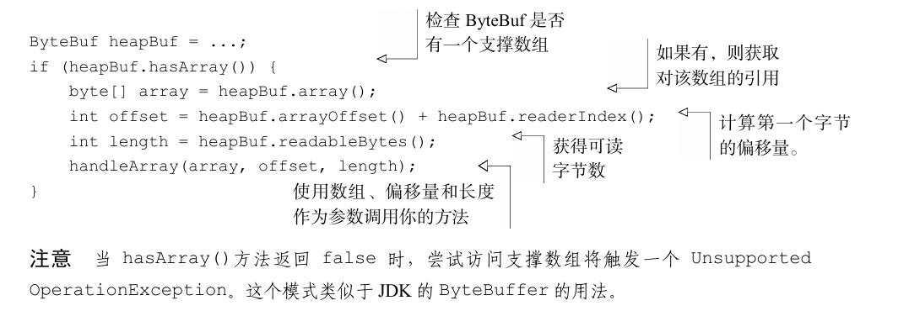
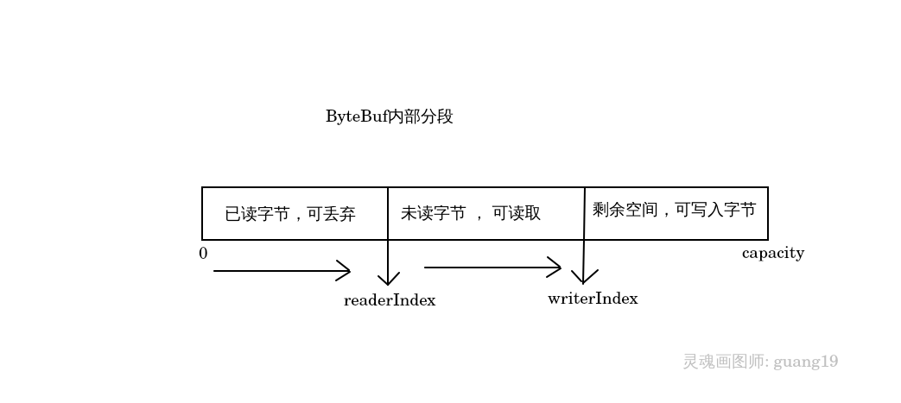
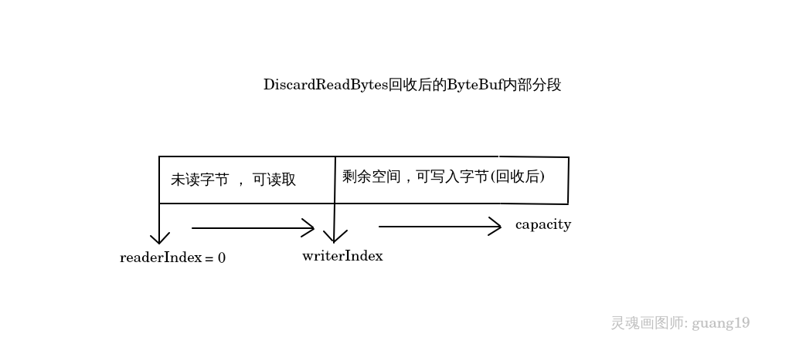
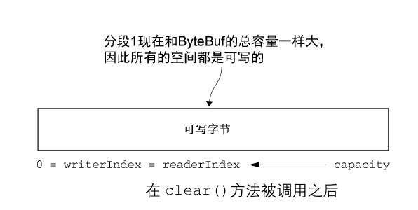

<!-- TOC -->
         
   * [ByteBuf--Netty的数据容器](#bytebuf--netty的数据容器)
       * [ByteBuf实现](#bytebuf实现)
       * [ByteBuf使用模式](#bytebuf使用模式)
       * [字节级别的操作](#字节级别的操作)
          * [索引访问](#索引访问)
          * [可丢弃字节](#可丢弃字节)
          * [可读字节](#可读字节)
          * [可写字节](#可写字节)
          * [索引管理](#索引管理)
          * [查找操作](#查找操作)
          * [衍生缓冲区](#衍生缓冲区)
       * [ByteBufHolder](#bytebufholder)
       * [ByteBuf分配](#bytebuf分配)
          * [ByteBufAllocator](#bytebufallocator)
          * [Unpooled](#unpooled)
          * [ByteBufUtil](#bytebufutil)
       * [引用计数](#引用计数)


<!--  TOC -->

# ByteBuf--Netty的数据容器
网络传输的基本单位是字节，在Java NIO中，JDK提供了Buffer接口，以及其相关的实现作为NIO操作
数据的容器，如ByteBuffer等等。 而Netty为了解决Buffer原生接口的复杂操作提供了ByteBuf，
ByteBuf是一个很好的经过优化过的数据容器，我们可以将字节数据添加到ByteBuf中或从ByteBuf中获取数据，
相比于原生Buffer，ByteBuf更加灵活和易用。

Netty的数据处理主要通过两个API提供：

1. abstract class ByteBuf
2. interface ByteBufHolder

使用ByteBuf API能够给我们带来良好的编码体验，如

- 在读和写这两种模式切换时，无需像ByteBuffer一样调用flip方法。

- 容量可以动态增长，如StringBuilder之于String。

- 支持方法的链式调用，如"a".append("b").append("c")这种形式。

...

ByteBuf还有很多好处，上面列举的只是一部分，其他优点就需要各位同学慢慢了解了。


### ByteBuf实现
ByteBuf维护了两个不同的索引：一个是用于读取的readerIndex ， 一个是用于写入的writerIndex。
当我们写入字节到ByteBuf后，writerIndex增加，开始读取字节后，readerIndex开始增加。读取字节直到
readerIndex和writerIndex到达同一位置（已经读取到末尾了），ByteBuf就变为不可读。
这就好比当我们访问数组时，超出了它的范围时，程序会抛出IndexOutOfBoundException。

当我们调用ByteBuf以read或write开头的方法时，将会增加这个ByteBuf的读索引或写索引，而诸如set或get
的方法则不会改变索引。

我们可以指定ByteBuf的最大容量，如果对ByteBuf的写入操作导致writerIndex超出了最大人容量，那么程序将会
抛出一个异常，ByteBuf的最大人容量是Integer.MAX_VALUE。 

ByteBuf大致的结构和状态：


### ByteBuf使用模式
ByteBuf有多种使用模式，我们可以根据需求构建不同使用模式的ByteBuf。

- 堆缓冲区(HeapByteBuf)： 最常用的ByteBuf模式是将数据存储在JVM的堆空间中，实际上是通过数组存储数据，
所以这种模式被称为支撑数组（Backing Array ）。所以这种模式被称为支撑数组可以在没有使用池化的情况下快速分配和释放，
适合用于有遗留数据需要处理的情况。



- 直接缓冲区(DirectByteBuf)： 在Java中，我们创建的对象大部分都是存储在堆区之中的，但这不是绝对的，在NIO的API中，
允许Buffer分配直接内存，即操作系统的内存，这样做的好处非常明显： 前面在传输章节介绍过的零拷贝技术的
特点之一就是规避了多次IO拷贝，而现在数据直接就在直接内存中，而不是在JVM应用进程中，这不仅减少了拷贝次数，
是否还意味着减少了用户态与内核态的上下文切换呢？
直接缓冲区的缺点也比较明显： 直接内存的分配和释放都较为昂贵，而且因为直接
缓冲区的数据不是在堆区的，所以我们在某些时候可能需要将直接缓冲区的数据先拷贝一个副本到堆区，
再对这个副本进行操作。 与支撑数组相比，直接缓冲区的工作可能更多，所以如果事先知道数据会作为
一个数组来被访问，那么我们应该使用堆内存。


- 复合缓冲区（CompositeByteBuf）： CompositeByteBuf为多个ByteBuf提供了一个聚合视图，
我们可以根据需要，向CompositeByteBuf中添加或删除ByteBuf实例，所以CompositeByteBuf中可能
同时包含直接缓冲区模式和堆缓冲区模式的ByteBuf。对于CompositeByteBuf的hasArray方法，
**如果CompositeByteBuf中只有一个ByteBuf实例，那么CompositeByteBuf的hasArray方法
将直接返回这唯一一个ByteBuf的hasArray方法的结果，否则返回false。**
除此之外，CompositeByteBuf还提供了许多附加的功能，可以查看Netty的文档学习。


### 字节级别的操作
除了普通的读写操作，ByteBuf还提供了修改数据的方法。


#### 索引访问
如数组的索引访问一样，ByteBuf的索引访问也是从零开始的，第一个字节的索引是0,最后一个字节的索引总是
capacity - 1：


注意：使用getByte方式访问，既不会改变readerIndex，也不会改变writerIndex。

JDK的ByteBuffer只有一个索引position，所以当ByteBuffer在读和写模式之间切换时，需要使用flip方法。
而ByteBuf同时具有读索引和写索引，则无需切换模式，在ByteBuf内部，其索引满足：

````text
0 <= readerIndex <= writerIndex <= capacity
````

这样的规律，当使用readerIndex读取字节，或使用writerIndex写入字节时，ByteBuf内部的分段大致如下：



上图介绍了在ByteBuf内部大致有3个分段，接下来我们就详细的介绍下这三个分段。


#### 可丢弃字节
上图中，当readerIndex读取一部分字节后，之前读过的字节就属于已读字节，可以被丢弃了，通过调用
ByteBuf的discardReadBytes方法我们可以丢弃这个分段，丢弃这个分段实际上是删除这个分段的已读字节，
然后回收这部分空间：




#### 可读字节
ByteBuf的可读字节分段存储了尚未读取的字节，我们可以使用readBytes等方法来读取这部分数据，如果我们读取
的范围超过了可读字节分段，那么ByteBuf会抛出IndexOutOfBoundsException异常，所以在读取数据之前，我们
需要使用isReadable方法判断是否仍然有可读字节分段。


#### 可写字节
可写字节分段即没有被写入数据的区域，我们可以使用writeBytes等方法向可写字节分段写入数据，如果我们写入
的字节超过了ByteBuf的容量，那么ByteBuf也会抛出IndexOutOfBoundsException异常。


#### 索引管理
我们可以通过markReaderIndex，markWriterIndex方法来标记当前readerIndex和writerIndex的位置，
然后使用resetReaderIndex，resetWriterIndex方法来将readerIndex和writerIndex重置为之前标记过的
位置。

我们还可以使用clear方法来将readerIndex和writerIndex重置为0，但是clear方法并不会清空ByteBuf的
内容，下面clear方法的实现：


其过程是这样的：




由于调用clear后，数据并没有被清空，但整个ByteBuf仍然是可写的，这比discardReadBytes轻量的多，
DiscardReadBytes还要回收已读字节空间。


#### 查找操作
在ByteBuf中，有多种可以确定值的索引的方法，最简单的方法是使用ByteBuf的indexOf方法。
较为复杂的查找可以通过ByteBuf的forEachByte方法，forEachByte方法所需的参数是ByteProcessor，
但我们无需去实现ByteProcessor，因为ByteProcessor已经为我们定义好了两个易用的实现。


#### 衍生缓冲区
衍生缓冲区是专门展示ByteBuf内部数据的视图，这种视图常通过以下方法创建：

- duplicate

- slice

- order

- readSlice

这些方法都将以源ByteBuf创建一个新的ByteBuf视图，所以源ByteBuf内部的索引和数据都与视图一样，
但这也意味着修改了视图的内容，也会修改源ByteBuf的内容。如果我们需要一个真实的ByteBuf的副本，
我们应该使用copy方法来创建，copy方法创建的副本拥有独立的内存，不会影响到源ByteBuf。


### ByteBufHolder
从表面理解起来，ByteBufHolder是ByteBuf的持有者，的确没有错。 ByteBuf几乎唯一的作用就是存储
数据，但在实际的数据传输中，除了数据，我们可能还需要存储各种属性值，Http便是一个很好的例子。
除了Http Content，还包括状态码，cookie等等属性，总不能把这些属性与Content存储在一个ByteBuf中吧，
所以Netty提供了ByteBufHolder。ByteBufHolder为Netty提供了高级特性的支持，如缓冲区持化，使得可以
从池中借用ByteBuf，并且在需要的时候自动释放。

以下是ByteBufHolder常见的方法：

- content: 返回这个ByteBufHolder所持有的ByteBuf。

- copy： 返回ByteBufHolder的深拷贝，连它持有的ByteBuf也拷贝。


### ByteBuf分配
前面介绍了ByteBuf的一些基本操作和原理，但却并未说明如何分配一个ByteBuf，这里将讲解ByteBuf的分配方式。


#### ByteBufAllocator
为了减少分配和释放内存的开销，Netty通过 ByteBufAllocator 实现了ByteBuf的池化。以下是ByteBufAllocator
的常见方法。

- buffer: 返回一个基于堆或直接内存的ByteBuf，具体取决于实现。

- heapBuffer： 返回一个基于堆内存的ByteBuf。

- directBuffer： 返回一个基于直接内存的ByteBuf。

- compositeBuffer： 返回一个组合ByteBuf。

- ioBuffer： 返回一个用于套接字的ByteBuf。

我们可以通过Channel或这ChannelHandlerContext的alloc方法获取到一个ByteBufAllocator


Netty提供了两种ByteBufAllocator的实现： PooledByteBufAllocator和UnpooledByteBufAllocator。
PooledByteBufAllocator池化了ByteBuf的实例以提高性能并最大限度的减少内存碎片，此实现的分配内存的方法
是使用[jemalloc](https://people.freebsd.org/~jasone/jemalloc/bsdcan2006/jemalloc.pdf)，此种
方法分配内存的效率非常高，已被大量现代操作系统采用。 UnpooledByteBufAllocator则不会池化ByteBuf，
Netty默认使用的是PooledByteBufALlocator。


#### Unpooled
当Channel或ChannelHandlerContext未引用ByteBufAllocator时，就无法使用ByteBufAllocator来分配
ByteBUf，对于这种情况，Netty提供了Unpooled工具类，它提供了一系列的静态方法来分配未池化的ByteBuf。


#### ByteBufUtil
ByteBufUtil是ByteBuf的一个工具类，它提供大量操作ByteBuf的方法，，其中非常重要的一个方法就是
hexDump，这个方法会以16进制的形式来表示ByteBuf的内容。另一个很重要的方法是equals，它被用于判断
ByteBuf之间的相等性。


### 引用计数
学习过JVM的小伙伴应该知道垃圾回收有引用计数法和可达性分析这两种算法判断对象是否存活，Netty就使用了
引用计数法来优化内存的使用。引用计数确保了当对象的引用计数大于1时，对象就不会被释放，当计数减少至0时，
对象就会被释放，如果程序访问一个已被释放的引用计数对象，那么将会导致一个
IllegalReferenceCountException异常。
在Netty中，ByteBuf和ByteBufHolder都实现了ReferenceCounted接口。
